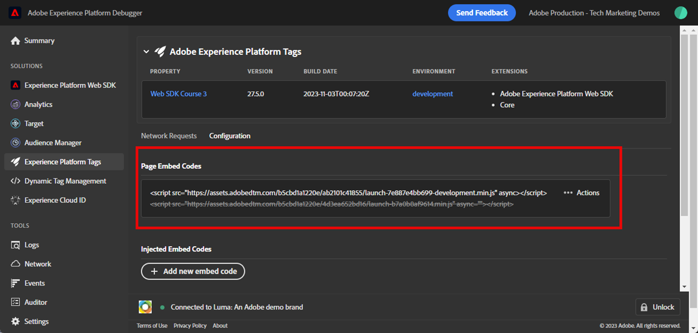

# WebSDK-Implementierungen mit Experience Platform Debugger validieren

Erfahren Sie, wie Sie Ihre Adobe Experience Platform Web SDK-Implementierung mit Adobe Experience Platform Debugger validieren.

Der Experience Platform Debugger ist eine Erweiterung, die für Chrome- und Firefox-Browser verfügbar ist und Ihnen dabei hilft, die auf Ihren Webseiten implementierte Adobe-Technologie zu sehen. Laden Sie die Version für Ihren bevorzugten Browser herunter:

* [Firefox-Erweiterung](https://addons.mozilla.org/de/firefox/addon/adobe-experience-platform-dbg/)
* [Chrome-Erweiterung](https://chromewebstore.google.com/detail/adobe-experience-platform/bfnnokhpnncpkdmbokanobigaccjkpob)

Wenn Sie den Debugger noch nie verwendet haben, sollten Sie sich dieses fünfminütige Übersichtsvideo ansehen:

>[!VIDEO](https://video.tv.adobe.com/v/32156?learn=on)

In dieser Lektion verwenden Sie die [Adobe Experience Platform Debugger-Erweiterung](https://chromewebstore.google.com/detail/adobe-experience-platform/bfnnokhpnncpkdmbokanobigaccjkpob), um die auf der [Demosite &quot;Luma&quot;](https://luma.enablementadobe.com/content/luma/us/en.html) hartcodierte Tag-Eigenschaft durch Ihre eigene Eigenschaft zu ersetzen.

Diese Technik wird als Umgebungswechsel bezeichnet und ist später hilfreich, wenn Sie mit Tags auf Ihrer eigenen Website arbeiten. Dadurch können Sie Ihre Produktions-Website in Ihren Browser laden, jedoch mit Ihrer *development* -Tag-Bibliothek. Mit dieser Funktion können Sie sicher Änderungen an Tags vornehmen und überprüfen - unabhängig von Ihren normalen Codeversionen. Schließlich ist diese Trennung der Marketing-Tag-Versionen von Ihren normalen Codeversionen einer der Hauptgründe, warum Kunden Tags überhaupt verwenden!

## Lernziele

Am Ende dieser Lektion können Sie den Debugger für Folgendes verwenden:

* Alternative Tag-Bibliothek laden
* Validieren Sie, dass das clientseitige XDM-Ereignis Daten erfasst und wie erwartet an Platform Edge Network sendet.
* Aktivieren Sie Edge Trace, um serverseitige Anfragen anzuzeigen, die vom Platform Edge Network gesendet werden.

## Voraussetzungen

Sie sind mit Datenerfassungs-Tags und der [Demosite &quot;Luma&quot;](https://luma.enablementadobe.com/content/luma/us/en.html){target="_blank"} vertraut und haben die vorherigen Lektionen im Tutorial abgeschlossen:

* [Konfigurieren eines XDM-Schemas](configure-schemas.md)
* [Identitäts-Namespace konfigurieren](configure-identities.md)
* [Konfigurieren eines Datenstroms](configure-datastream.md)
* [In der Tag-Eigenschaft installierte Web SDK-Erweiterung](install-web-sdk.md)
* [Erstellen von Datenelementen](create-data-elements.md)
* [Erstellen von Identitäten](create-identities.md)
* [Erstellen von Tag-Regeln](create-tag-rule.md)

## Alternative Tag-Bibliotheken mit Debugger laden

Der Experience Platform Debugger verfügt über eine coole Funktion, mit der Sie eine vorhandene Tag-Bibliothek durch eine andere ersetzen können. Diese Technik ist für die Validierung nützlich und ermöglicht es uns, viele Implementierungsschritte in diesem Tutorial zu überspringen.

1. Stellen Sie sicher, dass die [Luma Demowebsite](https://luma.enablementadobe.com/content/luma/us/en.html){target="_blank"} geöffnet ist, und wählen Sie das Symbol für die Experience Platform Debugger-Erweiterung aus.
1. Der Debugger wird geöffnet und zeigt einige Details zur hartcodierten Implementierung an (Sie müssen die Site &quot;Luma&quot;möglicherweise neu laden, nachdem Sie den Debugger geöffnet haben).
1. Vergewissern Sie sich, dass der Debugger &quot;**[!UICONTROL Verbunden mit Luma]**&quot; ist, wie unten dargestellt, und wählen Sie dann das Symbol &quot;**[!UICONTROL lock]**&quot;, um den Debugger mit der Site &quot;Luma&quot;zu sperren.
1. Wählen Sie die Schaltfläche **[!UICONTROL Anmelden]** aus und melden Sie sich mit Ihrer Adobe-ID bei Adobe Experience Cloud an.
1. Navigieren Sie nun im linken Navigationsbereich zu **[!UICONTROL Experience Platform-Tags]** .

   

1. Wählen Sie die Registerkarte **[!UICONTROL Konfiguration]** aus
1. Öffnen Sie rechts neben dem Bereich, in dem die eingebetteten **[!UICONTROL Seiten-Codes]** angezeigt werden, das Dropdown-Menü **[!UICONTROL Aktionen]** und wählen Sie **[!UICONTROL Ersetzen]** aus

   

1. Da Sie authentifiziert sind, ruft der Debugger Ihre verfügbaren Tag-Eigenschaften und -Umgebungen ab. Auswählen der Eigenschaft
1. Wählen Sie Ihre `Development`-Umgebung aus.
1. Wählen Sie die Schaltfläche **[!UICONTROL Anwenden]** aus

   

1. Die Luma-Website lädt jetzt _mit Ihrer eigenen Tag-Eigenschaft_ neu.

   

Während Sie das Tutorial fortsetzen, verwenden Sie diese Methode, um die Site &quot;Luma&quot;Ihrer eigenen Tag-Eigenschaft zuzuordnen und Ihre Platform Web SDK-Implementierung zu validieren. Wenn Sie Tags auf Ihrer eigenen Website verwenden, können Sie dieselbe Methode verwenden, um Entwicklungs-Tag-Bibliotheken auf Ihrer Produktions-Website zu validieren.

## Clientseitige Netzwerkanfragen mit Experience Platform Debugger überprüfen

Sie können den Debugger verwenden, um Client-seitige Beacons zu überprüfen, die von Ihrer Platform Web SDK-Implementierung ausgelöst wurden, um die an Platform Edge Network gesendeten Daten anzuzeigen:

1. Navigieren Sie im linken Navigationsbereich zu **[!UICONTROL Zusammenfassung]** , um die Details Ihrer Tag-Eigenschaft anzuzeigen.

   

1. Navigieren Sie nun im linken Navigationsbereich zu **[!UICONTROL Experience Platform Web SDK]** , um die **[!UICONTROL Netzwerkanforderungen]** anzuzeigen.
1. Öffnen Sie die Zeile **[!UICONTROL events]** .

   

1. Beachten Sie, dass Sie den Ereignistyp `web.webpagedetails.pageView` sehen können, den Sie in Ihrer Aktion [!UICONTROL Variable aktualisieren] angegeben haben, sowie weitere vordefinierte Variablen, die der Feldergruppe `AEP Web SDK ExperienceEvent` entsprechen

   

1. Scrollen Sie nach unten zum Objekt `web` , wählen Sie aus, um es zu öffnen, und überprüfen Sie die Objekte `webPageDetails.name`, `webPageDetails.server` und `webPageDetails.siteSection`. Sie sollten mit den entsprechenden `digitalData`-Datenschichtvariablen auf der Homepage übereinstimmen.

>[!TIP]
>
> So zeigen Sie die `digitalData`-Datenschicht auf der Homepage an und vergleichen sie:
>
> 1. Öffnen Sie auf der Startseite von Luma die Browser-Entwicklertools. Wählen Sie im Fall von Chrome die Schaltfläche `F12` auf Ihrer Tastatur aus
> 1. Wählen Sie die Registerkarte **[!UICONTROL Konsole]** aus.
> 1. Geben Sie `digitalData` ein und wählen Sie `Enter` auf Ihrer Tastatur aus, um die Datenschichtwerte anzuzeigen

Sie können auch die Identitätszuordnungsdetails überprüfen:

1. Melden Sie sich mit den Anmeldedaten `test@adobe.com`/`test` bei der Site &quot;Luma&quot;an

1. Kehren Sie zur [Startseite „Luma“](https://luma.enablementadobe.com/content/luma/us/en.html) zurück.

1. Öffnen Sie den Abschnitt **[!UICONTROL Experience Platform Web SDK]** im linken Navigationsbereich.

   

1. Wählen Sie die Zeile **[!UICONTROL events]** aus, um Details in einem Popup zu öffnen

   

1. Suchen Sie im Popup nach der **identityMap** . Hier sollte `lumaCrmId` mit drei Schlüsseln von authenticatedState, id und primary angezeigt werden:
   

### Clientseitige Anforderungen mit Browserdev-Tools überprüfen

Diese Arten von Anforderungsdetails sind auch auf der Registerkarte **Netzwerk** der Webentwicklertools des Browsers sichtbar (vorausgesetzt, die Website lädt Ihre Tag-Bibliothek).

1. Öffnen Sie die Registerkarte **Netzwerk** der Webentwickler-Tools des Browsers und laden Sie die Seite neu. Filtern Sie nach Aufrufen mit &quot;`/ee`&quot;, um den Aufruf zu finden, wählen Sie ihn aus und sehen Sie sich dann die Registerkarte &quot;**Headers**&quot;und die Registerkarte &quot;**Payload**&quot;an.

   

1. Gehen Sie zur Registerkarte **Antwort** und beachten Sie, wie der ECID-Wert in der Antwort enthalten ist.

   

   >[!NOTE]
   >
   > Der ECID-Wert ist in der Netzwerkantwort sichtbar. Sie ist nicht im Abschnitt `identityMap` der Netzwerkanforderung enthalten und wird auch nicht in diesem Format in einem Cookie gespeichert.

## Serverseitige Netzwerkanforderungen mit Experience Platform Debugger überprüfen

Wie Sie in der Lektion [Datensatz konfigurieren](configure-datastream.md) gelernt haben, sendet das Platform Web SDK zunächst Daten aus Ihrer digitalen Eigenschaft an das Platform-Edge Network. Anschließend sendet Platform Edge Network zusätzliche serverseitige Anfragen an die entsprechenden Dienste, die in Ihrem Datastream aktiviert sind. Sie können die serverseitigen Anforderungen von Platform Edge Network mithilfe von Edge Trace im Debugger überprüfen.

<!--Furthermore, you can also validate the fully processed payload after it reaches an Adobe application by using [Adobe Experience Platform Assurance](https://experienceleague.adobe.com/en/docs/experience-platform/assurance/home). -->

### Aktivieren von Edge Trace

So aktivieren Sie Edge Trace:

1. Wählen Sie im linken Navigationsbereich von **[!UICONTROL Experience Platform Debugger]** **[!UICONTROL Protokolle]** aus.
1. Wählen Sie die Registerkarte **[!UICONTROL Edge]** und dann **[!UICONTROL Verbinden]** aus.

   

1. Derzeit ist er leer

   

1. Aktualisieren Sie die [Luma-Startseite](https://luma.enablementadobe.com/) und aktivieren Sie erneut den **[!UICONTROL Experience Platform-Debugger]** , um zu sehen, wie die Daten durchlaufen werden.

   

Sie können zu diesem Zeitpunkt keine Platform Edge Network-Anfragen für Adobe-Anwendungen anzeigen, da Sie im Datastream keine aktiviert haben. In zukünftigen Lektionen verwenden Sie Edge Trace, um die ausgehenden serverseitigen Anforderungen an Adobe-Anwendungen und die Ereignisweiterleitung anzuzeigen. Erfahren Sie jedoch zunächst mehr über ein anderes Tool zur Validierung von serverseitigen Anforderungen von Platform Edge Network - Adobe Experience Platform Assurance!

[Weiter: ](validate-with-assurance.md)

>[!NOTE]
>
>Vielen Dank, dass Sie Ihre Zeit investiert haben, um mehr über das Adobe Experience Platform Web SDK zu erfahren. Wenn Sie Fragen haben, ein allgemeines Feedback teilen oder Anregungen zu künftigen Inhalten haben möchten, teilen Sie diese bitte in diesem [Experience League Community-Diskussionsbeitrag](https://experienceleaguecommunities.adobe.com/t5/adobe-experience-platform-data/tutorial-discussion-implement-adobe-experience-cloud-with-web/td-p/444996) mit.
