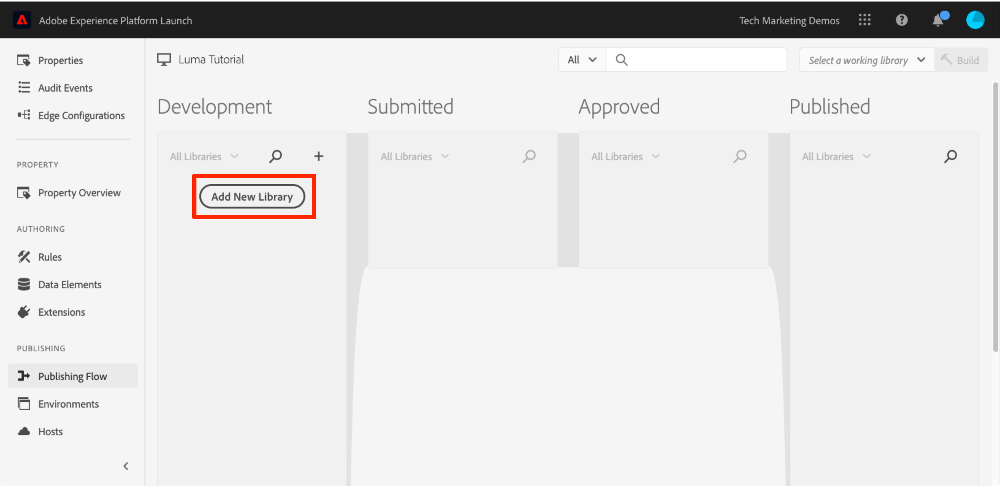
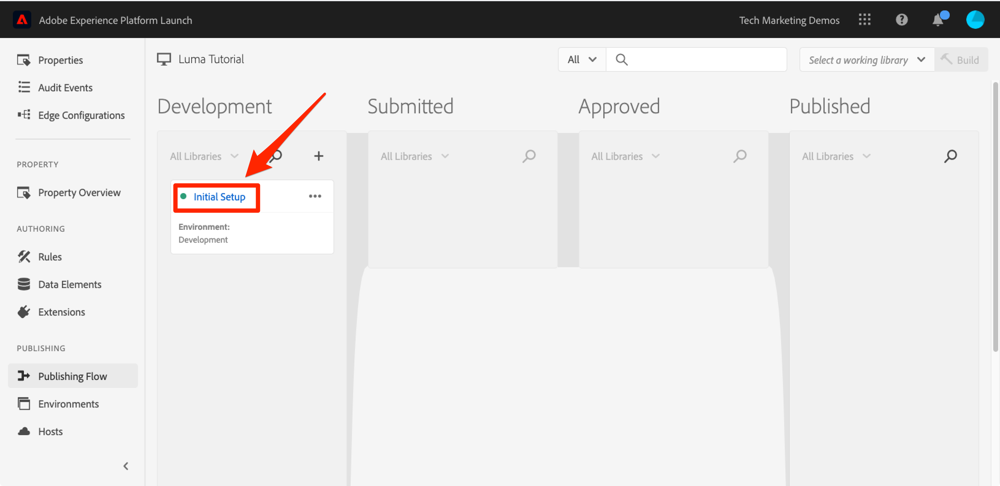

# Hinzufügen eines Datenelements, einer Regel und einer Bibliothek

In dieser Lektion erstellen Sie Ihr erstes Datenelement, Ihre erste Regel und Ihre erste Bibliothek.

Datenelemente und Regeln sind die Grundbausteine von Tags. Datenelemente speichern die Attribute, die Sie an Ihre Marketing- und Werbelösungen senden möchten, während Regeln die Anforderungen an diese Lösungen unter den richtigen Bedingungen auslösen.  Bibliotheken sind die JavaScript-Dateien, die auf der Seite geladen werden, um alle Aufgaben auszuführen. In dieser Lektion werden Sie alle drei verwenden, damit unsere Beispielseite etwas tut.

>[!NOTE]
>
>Adobe Experience Platform Launch wird als eine Suite von Datenerfassungstechnologien in Adobe Experience Platform integriert. In der Benutzeroberfläche wurden mehrere terminologische Änderungen eingeführt, die Sie bei der Verwendung dieses Inhalts beachten sollten:
>
> * Platform launch (Client-seitig) ist jetzt **[[!DNL tags]](https://experienceleague.adobe.com/docs/experience-platform/tags/home.html?lang=de)**
> * Platform launch Server Side ist jetzt **[[!DNL event forwarding]](https://experienceleague.adobe.com/docs/experience-platform/tags/event-forwarding/overview.html?lang=de)**
> * Edge-Konfigurationen sind jetzt **[[!DNL datastreams]](https://experienceleague.adobe.com/docs/experience-platform/edge/fundamentals/datastreams.html?lang=de)**

## Lernziele

Am Ende dieser Lektion können Sie:

* ein Datenelement erstellen
* eine Regel erstellen
* eine Bibliothek erstellen
* Änderungen zu einer Bibliothek hinzufügen
* überprüfen, ob Ihre Bibliothek in Ihrem Webbrowser geladen wird
* die Arbeitsbibliothek-Funktion für effizienteres Arbeiten verwenden

## Erstellen eines Datenelements für Seitennamen

Datenelemente sind die Tags-Version einer Datenschicht. Sie können Werte aus Ihrem eigenen Daten-Layer-Objekt, Ihren Cookies, Ihren lokalen Speicherobjekten, Ihren Abfragezeichenfolgenparametern, Ihren Seitenelementen, Ihren Meta-Tags usw. speichern. In dieser Übung erstellen Sie ein Datenelement für den Seitennamen, das Sie später in Ihren Target- und Analytics-Implementierungen verwenden werden.

**Erstellen eines Datenelements**

1. Klicken Sie im linken Navigationsbereich auf **[!UICONTROL Datenelemente]**

1. Da Sie noch keine Datenelemente in dieser Eigenschaft erstellt haben, wird ein kurzes Video mit zusätzlichen Informationen zu diesem Thema angezeigt. Sehen Sie sich dieses Video an, wenn Sie möchten.

1. Klicken Sie auf **[!UICONTROL Schaltfläche Neues Datenelement]**:

   

1. Benennen Sie das Datenelement, z. B. `Page Name`

1. Verwenden Sie den [!UICONTROL JavaScript-Variablen]-Datenelementtyp, um auf einen Wert im Daten-Layer Ihrer Beispielseite zu verweisen: `digitalData.page.pageInfo.pageName`

1. Markieren Sie die Kästchen für **[!UICONTROL Kleinbuchstaben erzwingen]** und **[!UICONTROL Text bereinigen]**, um die Groß-/Kleinschreibung zu standardisieren und überflüssige Leerzeichen zu entfernen

1. Belassen **[!UICONTROL Keine]** als Einstellung **[!UICONTROL Speicherdauer]** da dieser Wert normalerweise auf jeder Seite unterschiedlich ist

1. Klicken Sie auf **[!UICONTROL Speichern]**, um das Datenelement zu speichern

   

>[!NOTE]
>
>Datenelementfunktionen (_mit Erweiterungen erweitert werden_. Beispielsweise können Sie mit der ContextHub-Erweiterung Datenelemente mithilfe von Funktionen der Erweiterung hinzufügen.

## Erstellen einer Regel

Als Nächstes verwenden Sie dieses Datenelement in einer einfachen Regel. Regeln gehören zu den leistungsfähigsten Funktionen in Tags und ermöglichen es Ihnen, festzulegen, was bei der Interaktion des Besuchers mit Ihrer Website geschehen soll. Wenn die in Ihren Regeln formulierten Kriterien erfüllt sind, löst die Regel die von Ihnen festgelegte Aktion aus.

Sie erstellen eine Regel, die den Datenelementwert des Seitennamens für die Browserkonsole ausgibt.

**Erstellen einer Regel**

1. Klicken Sie in der linken Navigation auf **[!UICONTROL Regeln]**

1. Da Sie noch keine Regeln in dieser Eigenschaft erstellt haben, wird ein kurzes Video mit zusätzlichen Informationen zum Thema angezeigt. Sehen Sie sich dieses Video an, wenn Sie möchten.

1. Klicken Sie auf **[!UICONTROL Schaltfläche „Neue Regel erstellen]**:

   

1. Nennen Sie die Regel `All Pages - Library Loaded`. Diese Namenskonvention gibt an, wo und wann die Regel ausgelöst wird, sodass Sie im Laufe der Reife Ihrer Tag-Eigenschaft leichter identifizieren und wiederverwenden können.

1. Klicken Sie unter Ereignisse auf **[!UICONTROL Hinzufügen]**. Das Ereignis teilt Tags mit, wann die Regel ausgelöst werden soll, und kann viele Dinge umfassen, z. B. das Laden einer Seite, ein Klicken, ein benutzerdefiniertes JavaScript-Ereignis usw.

   

   1. Wählen Sie als Ereignistyp **[!UICONTROL Bibliothek geladen (Seite oben)]** aus. Beachten Sie, dass bei Auswahl des Ereignistyps Tags anhand Ihrer Auswahl einen Namen für das Ereignis vorab ausfüllt. Beachten Sie auch, dass die Standardreihenfolge für das Ereignis 50 beträgt. Die Sortierung ist eine leistungsstarke Funktion in Tags, mit der Sie die Sequenz von Aktionen genau steuern können, wenn mehrere Regeln durch dasselbe Ereignis ausgelöst werden. Sie werden diese Funktion später im Tutorial verwenden.

   1. Klicken Sie auf **[!UICONTROL Schaltfläche Änderungen beibehalten]**

   

1. Da diese Regel auf allen Seiten ausgelöst werden soll, lassen Sie **[!UICONTROL Bedingungen]** leer. Wenn Sie das Bedingungsmodalfenster öffnen, können Sie erkennen, dass Bedingungen aufgrund einer Vielzahl von Optionen, wie URLs, Datenelementwerten und Datumsbereichen, sowohl Beschränkungen als auch Ausnahmen hinzufügen können.

1. Klicken Sie unter Aktionen auf **[!UICONTROL Hinzufügen]**

1. Wählen Sie **[!UICONTROL Aktionstyp > Benutzerdefinierter Code]** aus, was zu diesem Zeitpunkt die einzige Option ist. Später im Tutorial werden weitere Optionen zur Verfügung stehen, nachdem Sie Erweiterungen hinzugefügt haben.

1. Wählen Sie **[!UICONTROL &lt;/> Editor öffnen]**, um den Code-Editor zu öffnen

   

1. Fügen Sie dem Codeeditor Folgendes hinzu. Dieser Code gibt den Wert des Datenelements „Seitenname“ an die Browser-Konsole aus, damit Sie bestätigen können, dass es funktioniert:

   ```javascript
   console.log('The page name is '+_satellite.getVar('Page Name'));
   ```

1. Speichern Sie den Codeeditor.

   

1. Klicken Sie im Bildschirm Aktionskonfiguration auf **[!UICONTROL Änderungen beibehalten]**

1. Klicken Sie **[!UICONTROL Speichern]**, um die Regel zu speichern

Auf der Seite Regeln sollte Ihre neue Regel angezeigt werden:


## Ihre Änderungen in einer Bibliothek speichern

Nachdem Sie eine Sammlung von Erweiterungen, Datenelementen und Regeln in der Datenerfassungsschnittstelle konfiguriert haben, müssen Sie diese Funktionen und Logik in einen Satz von JavaScript-Code packen, den Sie auf Ihrer Website bereitstellen können, damit Marketing-Tags ausgelöst werden, wenn Besucher zur Website kommen. Bei einer Bibliothek handelt es sich um den Satz von JavaScript-Code, der dies ausführt.

In einer früheren Lektion haben Sie den Einbettungscode Ihrer Entwicklungsumgebung auf der Beispielseite implementiert. Beim Laden der Beispielseite wurde ein 404-Fehler für die Einbettungs-Code-URL zurückgegeben, da noch keine Tag-Bibliothek erstellt und der Umgebung zugewiesen wurde. Fügen Sie jetzt Ihr neues Datenelement und Ihre Regel in eine Bibliothek ein, damit Ihre Beispielseite etwas tun kann.

**Hinzufügen und Aufbauen einer Bibliothek**

1. Klicken Sie in der linken Navigation auf **[!UICONTROL Publishing Flow]**

1. Klicken Sie **[!UICONTROL Neue Bibliothek hinzufügen]**

   

1. Benennen Sie die Bibliothek, z. B. `Initial Setup`

1. Wählen Sie **[!UICONTROL Umgebung > Entwicklung]**

1. Klicken Sie **[!UICONTROL Alle geänderten Ressourcen hinzufügen]**

   

1. Beachten Sie, dass Tags nach dem Klicken **[!UICONTROL Alle geänderten Ressourcen hinzufügen]** die soeben vorgenommenen Änderungen zusammenfasst.

1. Klicken Sie auf **[!UICONTROL Für Entwicklung speichern und erstellen]**

   

Nach einigen Augenblicken wird der Statuspunkt grün und zeigt die erfolgreich erstellte Bibliothek an.



## Überprüfen Ihrer Änderungen

Überprüfen Sie jetzt, ob Ihre Regel erwartungsgemäß funktioniert.

Laden Sie Ihre Musterseite erneut. Wenn Sie sich die Registerkarte Entwickler-Tools > Netzwerk ansehen, sollten Sie jetzt eine 200-Antwort für Ihre Tag-Bibliothek sehen!


Wenn Sie sich „Entwicklungstools -> Konsole“ ansehen, sehen Sie den Text „Der Seitenname ist Startseite“.


Herzlichen Glückwunsch! Sie haben Ihr erstes Datenelement und Ihre erste Regel erstellt und Ihre erste Tag-Bibliothek erstellt!

## Verwenden der Arbeitsbibliothek-Funktion

Wenn Sie viele Änderungen an Tags vornehmen, ist es unbequem, jedes Mal auf die Registerkarte Publishing zu kommen, Änderungen hinzuzufügen und die Bibliothek zu erstellen, wenn Sie das Ergebnis sehen möchten.  Nachdem Sie die Bibliothek „Ersteinrichtung“ erstellt haben, können Sie die Arbeitsbibliothek-Funktion verwenden, um Ihre Änderungen schnell zu speichern und die Bibliothek in einem Schritt neu zu erstellen.

Nehmen Sie eine kleine Änderung an der Regel „Alle Seiten – Bibliothek geladen“ vor. Klicken Sie im linken Navigationsbereich auf **[!UICONTROL Regeln]** und klicken Sie dann auf die `All Pages - Library Loaded` Regel, um sie zu öffnen.


Klicken Sie auf der Seite &quot;`Edit Rule`&quot; auf ***[!UICONTROL Dropdown-]*** „Arbeitsbibliothek“ und wählen Sie Ihre `Initial Setup` aus.


Nachdem Sie die Bibliothek ausgewählt haben, sollten Sie sehen, dass die Schaltfläche **[!UICONTROL Speichern]** jetzt standardmäßig **[!UICONTROL In Bibliothek speichern]** lautet. Wenn Sie Änderungen an Tags vornehmen, können Sie diese Option verwenden, um die Änderungen automatisch direkt Ihrer Arbeitsbibliothek hinzuzufügen und/oder neu zu erstellen.

Testen Sie es aus. Öffnen Sie die Aktion „Benutzerdefinierter Code“ und fügen Sie einen Doppelpunkt nach dem Text „Der Name der Seite ist“ hinzu, sodass der gesamte Codeblock folgendermaßen lautet:

```javascript
console.log('The page name is: '+_satellite.getVar('Page Name'));
```

Speichern Sie den Code, behalten Sie die Änderungen in der Aktion bei und klicken Sie jetzt auf die Schaltfläche **[!UICONTROL In Bibliothek speichern und erstellen]**.


Warten Sie einen Augenblick, bis der grüne Punkt neben dem Dropdown-Menü [!UICONTROL Arbeitsbibliothek] erneut angezeigt wird. Laden Sie jetzt Ihre Beispielseite neu und Sie sollten Ihre Änderung in der Konsolenmeldung sehen (Sie müssen möglicherweise Ihren Browser-Cache löschen und neu laden, um die Änderung an der Seite zu sehen):


Dies ist eine viel schnellere Arbeitsweise und Sie werden diesen Ansatz für den Rest des Tutorials verwenden.

[Weiter „Wechseln von Umgebungen mit dem Experience Cloud Debugger&quot; >](switch-environments.md)
