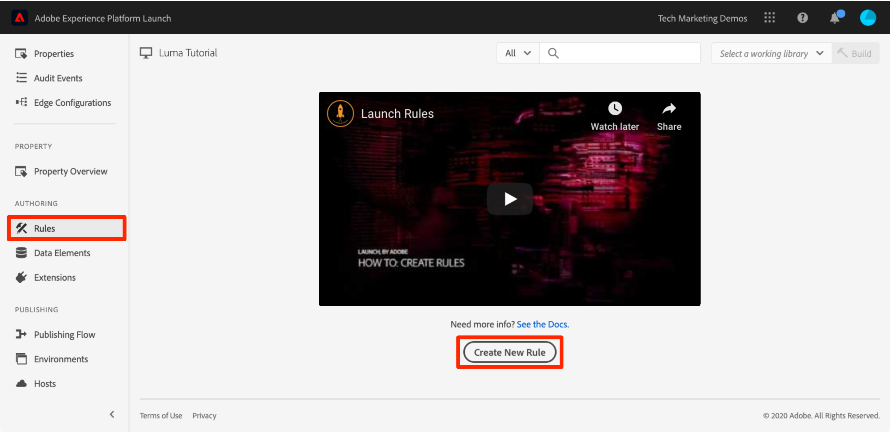
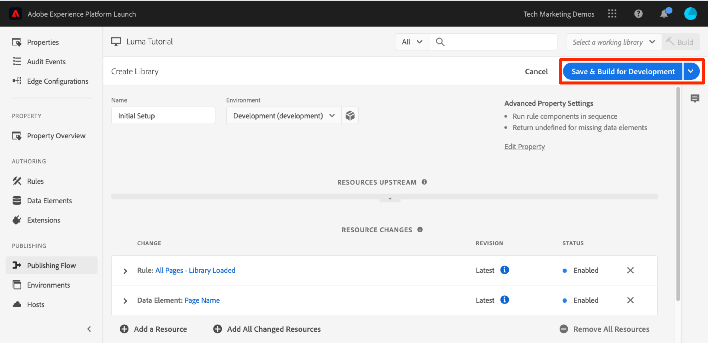

# Hinzufügen von Datenelementen, Regeln und Bibliotheken

In dieser Lektion erstellen Sie Ihr erstes Datenelement, Ihre erste Regel und Ihre erste Bibliothek.

Datenelemente und Regeln sind die grundlegenden Bausteine von Tags. Datenelemente speichern die Attribute, die Sie an Ihre Marketing- und Werbelösungen senden möchten, während Regeln die Anforderungen an diese Lösungen unter den richtigen Bedingungen auslösen.  Bibliotheken sind die JavaScript-Dateien, die auf der Seite geladen werden, um alle Aufgaben auszuführen. In dieser Lektion werden Sie alle drei verwenden, damit unsere Beispielseite etwas tut.

>[!NOTE]
>
>Adobe Experience Platform Launch wird als eine Suite von Datenerfassungstechnologien in Adobe Experience Platform integriert. In der Benutzeroberfläche wurden verschiedene terminologische Änderungen eingeführt, die Sie bei der Verwendung dieses Inhalts beachten sollten:
>
> * platform launch (Client-seitig) ist jetzt **[[!DNL tags]](https://experienceleague.adobe.com/docs/experience-platform/tags/home.html?lang=de)**
> * platform launch Server Side ist jetzt **[[!DNL event forwarding]](https://experienceleague.adobe.com/docs/experience-platform/tags/event-forwarding/overview.html)**
> * Edge-Konfigurationen sind jetzt verfügbar **[[!DNL datastreams]](https://experienceleague.adobe.com/docs/experience-platform/edge/fundamentals/datastreams.html?lang=de)**


## Lernziele

Am Ende dieser Lektion können Sie:

* ein Datenelement erstellen
* eine Regel erstellen
* eine Bibliothek erstellen
* Änderungen zu einer Bibliothek hinzufügen
* überprüfen, ob Ihre Bibliothek in Ihrem Webbrowser geladen wird
* die Arbeitsbibliothek-Funktion für effizienteres Arbeiten verwenden

## Erstellen eines Datenelements für Seitennamen

Datenelemente sind die Tag-Version einer Datenschicht. Sie können Werte aus Ihrem eigenen Daten-Layer-Objekt, Ihren Cookies, Ihren lokalen Speicherobjekten, Ihren Abfragezeichenfolgenparametern, Ihren Seitenelementen, Ihren Meta-Tags usw. speichern. In dieser Übung erstellen Sie ein Datenelement für den Seitennamen, das Sie später in Ihren Target- und Analytics-Implementierungen verwenden werden.

**Erstellen eines Datenelements**

1. Klicken Sie im linken Navigationsbereich auf **[!UICONTROL Datenelemente]**

1. Da Sie noch keine Datenelemente in dieser Eigenschaft erstellt haben, wird ein kurzes Video mit zusätzlichen Informationen zu diesem Thema angezeigt. Sehen Sie sich dieses Video an, wenn Sie möchten.

1. Klicken Sie auf die Schaltfläche **[!UICONTROL Neues Datenelement erstellen]**:

   

1. Benennen Sie das Datenelement, z. B. `Page Name`

1. Verwenden Sie den [!UICONTROL JavaScript-Variablen]-Datenelementtyp, um auf einen Wert im Daten-Layer Ihrer Beispielseite zu verweisen: `digitalData.page.pageInfo.pageName`

1. Markieren Sie die Kästchen für **[!UICONTROL Wert in Kleinbuchstaben erzwingen]** und **[!UICONTROL Text bereinigen]**, um die Groß-/Kleinschreibung zu standardisieren und unnötige Leerzeichen zu entfernen

1. Belassen Sie die Einstellung **[!UICONTROL Keine]** als **[!UICONTROL Speicherdauer]**, da dieser Wert typischerweise auf jeder Seite unterschiedlich ist.

1. Klicken Sie auf die Schaltfläche **[!UICONTROL Speichern]**, um das Datenelement zu speichern.

   

>[!NOTE]
>
>Datenelementfunktionen _können mit Erweiterungen erweitert werden_. Beispielsweise können Sie mit der ContextHub-Erweiterung Datenelemente mithilfe von Funktionen der Erweiterung hinzufügen.

## Erstellen einer Regel

Als Nächstes verwenden Sie dieses Datenelement in einer einfachen Regel. Regeln sind eine der leistungsstärksten Funktionen in Tags und ermöglichen es Ihnen, festzulegen, was passieren soll, wenn der Besucher mit Ihrer Website interagiert. Wenn die in Ihren Regeln formulierten Kriterien erfüllt sind, löst die Regel die von Ihnen festgelegte Aktion aus.

Sie erstellen eine Regel, die den Datenelementwert des Seitennamens für die Browserkonsole ausgibt.

**Erstellen einer Regel**

1. Klicken Sie im linken Navigationsbereich auf **[!UICONTROL Regeln]**

1. Da Sie noch keine Regeln in dieser Eigenschaft erstellt haben, wird ein kurzes Video mit zusätzlichen Informationen zum Thema angezeigt. Sehen Sie sich dieses Video an, wenn Sie möchten.

1. Klicken Sie auf die Schaltfläche **[!UICONTROL Neue Regel erstellen]**:

   

1. Nennen Sie die Regel `All Pages - Library Loaded`. Diese Namenskonvention gibt an, wo und wann die Regel ausgelöst wird. Dies erleichtert die Identifizierung und Wiederverwendung während der Entwicklung Ihrer Tag-Eigenschaft.

1. Klicken Sie unter „Ereignisse“ auf **[!UICONTROL Hinzufügen]**. Das Ereignis gibt an, wann Tags ausgelöst werden sollen. Dabei kann es sich um viele Aspekte handeln, darunter Seitenladung, Klick, benutzerspezifisches JavaScript-Ereignis.

   

   1. Wählen Sie als Ereignistyp **[!UICONTROL Bibliothek geladen (Seite oben)]** aus. Beachten Sie, dass bei der Auswahl des Ereignistyps durch Tags ein Name für das Ereignis anhand Ihrer Auswahl vorausgefüllt wird. Beachten Sie auch, dass die Standardreihenfolge für das Ereignis 50 beträgt. Die Reihenfolge ist eine leistungsstarke Funktion in Tags, die Ihnen eine präzise Steuerung der Aktionssequenz ermöglicht, wenn mehrere Regeln durch dasselbe Ereignis ausgelöst werden. Sie werden diese Funktion später im Tutorial verwenden.

   1. Klicken Sie auf die Schaltfläche **[!UICONTROL Änderungen beibehalten]**.

   

1. Da diese Regel auf allen Seiten ausgelöst werden soll, lassen Sie **[!UICONTROL Bedingungen]** leer. Wenn Sie das Bedingungsmodalfenster öffnen, können Sie erkennen, dass Bedingungen aufgrund einer Vielzahl von Optionen, wie URLs, Datenelementwerten und Datumsbereichen, sowohl Beschränkungen als auch Ausnahmen hinzufügen können.

1. Klicken Sie unter „Aktionen“ auf **[!UICONTROL Hinzufügen]**.

1. Wählen Sie **[!UICONTROL Aktionstyp > Benutzerdefinierter Code]** aus, was derzeit die einzige Option ist. Später im Tutorial werden weitere Optionen zur Verfügung stehen, nachdem Sie Erweiterungen hinzugefügt haben.

1. Wählen Sie **[!UICONTROL &lt;/> Editor öffnen]** aus, um den Codeeditor zu öffnen.

   

1. Fügen Sie dem Codeeditor Folgendes hinzu. Dieser Code gibt den Wert des Datenelements „Seitenname“ an die Browser-Konsole aus, damit Sie bestätigen können, dass es funktioniert:

   ```javascript
   console.log('The page name is '+_satellite.getVar('Page Name'));
   ```

1. Speichern Sie den Codeeditor.

   

1. Klicken Sie im Fenster „Aktionskonfiguration“ auf **[!UICONTROL Änderungen beibehalten]**.

1. Klicken Sie auf **[!UICONTROL Speichern]**, um die Regel zu speichern.

Auf der Seite Regeln sollte Ihre neue Regel angezeigt werden:


## Ihre Änderungen in einer Bibliothek speichern

Nachdem Sie eine Sammlung von Erweiterungen, Datenelementen und Regeln in der Datenerfassungsoberfläche konfiguriert haben, müssen Sie diese Funktionen und Logik in einen Satz von JavaScript-Code verpacken, den Sie auf Ihrer Website bereitstellen können, damit Marketing-Tags ausgelöst werden, wenn Besucher zur Site gelangen. Bei einer Bibliothek handelt es sich um den Satz von JavaScript-Code, der dies ausführt.

In einer früheren Lektion haben Sie den Einbettungscode Ihrer Entwicklungsumgebung auf der Beispielseite implementiert. Beim Laden der Beispielseite wurde ein 404-Fehler für die Einbettungscode-URL zurückgegeben, da noch keine Tag-Bibliothek erstellt und der Umgebung zugewiesen war. Fügen Sie jetzt Ihr neues Datenelement und Ihre Regel in eine Bibliothek ein, damit Ihre Beispielseite etwas tun kann.

**Hinzufügen und Aufbauen einer Bibliothek**

1. Klicken Sie im linken Navigationsbereich auf **[!UICONTROL Veröffentlichungsfluss]**

1. Klicken Sie auf **[!UICONTROL Neue Bibliothek hinzufügen]**.

   

1. Benennen Sie die Bibliothek, z. B. `Initial Setup`

1. Wählen Sie **[!UICONTROL Umgebung > Entwicklung]** aus.

1. Klicken Sie auf **[!UICONTROL Alle geänderten Ressourcen hinzufügen]**.

   

1. Beachten Sie Folgendes: **[!UICONTROL Alle geänderten Ressourcen hinzufügen]** -Tags fassen die soeben vorgenommenen Änderungen zusammen.

1. Klicken Sie auf **[!UICONTROL Speichern und Build zur Entwicklung erstellen]**

   

Nach einigen Augenblicken wird der Statuspunkt grün und zeigt die erfolgreich erstellte Bibliothek an.


## Überprüfen Ihrer Änderungen

Überprüfen Sie jetzt, ob Ihre Regel erwartungsgemäß funktioniert.

Laden Sie Ihre Musterseite erneut. Wenn Sie sich die Registerkarte &quot;Entwicklertools -> Netzwerk&quot;ansehen, sollten Sie jetzt eine Antwort mit 200 für Ihre Tag-Bibliothek sehen!


Wenn Sie sich „Entwicklungstools -> Konsole“ ansehen, sehen Sie den Text „Der Seitenname ist Startseite“.


Herzlichen Glückwunsch! Sie haben Ihr erstes Datenelement und Ihre erste Regel erstellt und Ihre erste Tag-Bibliothek erstellt!

## Verwenden der Arbeitsbibliothek-Funktion

Wenn Sie viele Änderungen an Tags vornehmen, ist es nicht praktisch, jedes Mal, wenn Sie das Ergebnis sehen möchten, zur Registerkarte &quot;Veröffentlichung&quot;zu wechseln, Änderungen hinzuzufügen und die Bibliothek zu erstellen.  Nachdem Sie die Bibliothek „Ersteinrichtung“ erstellt haben, können Sie die Arbeitsbibliothek-Funktion verwenden, um Ihre Änderungen schnell zu speichern und die Bibliothek in einem Schritt neu zu erstellen.

Nehmen Sie eine kleine Änderung an der Regel „Alle Seiten – Bibliothek geladen“ vor. Klicken Sie im linken Navigationsbereich auf **[!UICONTROL Regeln]** und klicken Sie dann auf `All Pages - Library Loaded` -Regel, um sie zu öffnen.


Klicken Sie auf der `Edit Rule`-Seite auf das Dropdown-Menü ***[!UICONTROL Arbeitsbibliothek]*** und wählen Sie Ihre Bibliothek `Initial Setup` aus.


Nachdem Sie die Bibliothek ausgewählt haben, sollten Sie sehen, dass die **[!UICONTROL Speichern]** Schaltfläche standardmäßig **[!UICONTROL In Bibliothek speichern]**. Wenn Sie eine Änderung an Tags vornehmen, können Sie diese Option verwenden, um die Änderung automatisch direkt zu Ihrer Arbeitsbibliothek hinzuzufügen und/oder sie neu zu erstellen.

Testen Sie es aus. Öffnen Sie die Aktion „Benutzerdefinierter Code“ und fügen Sie einen Doppelpunkt nach dem Text „Der Name der Seite ist“ hinzu, sodass der gesamte Codeblock folgendermaßen lautet:

```javascript
console.log('The page name is: '+_satellite.getVar('Page Name'));
```

Speichern Sie den Code, behalten Sie die Änderungen in der Aktion bei und klicken Sie jetzt auf die Schaltfläche **[!UICONTROL In Bibliothek speichern und erstellen]**.


Warten Sie einen Augenblick, bis der grüne Punkt neben dem Dropdown-Menü [!UICONTROL Arbeitsbibliothek] erneut angezeigt wird. Laden Sie jetzt Ihre Beispielseite neu und Sie sollten Ihre Änderung in der Konsolenmeldung sehen (Sie müssen möglicherweise Ihren Browser-Cache löschen und neu laden, um die Änderung an der Seite zu sehen):


Dies ist eine viel schnellere Arbeitsweise und Sie werden diesen Ansatz für den Rest des Tutorials verwenden.

[Weiter mit „Wechseln von Umgebungen mit Experience Cloud Debugger“ >](switch-environments.md)
