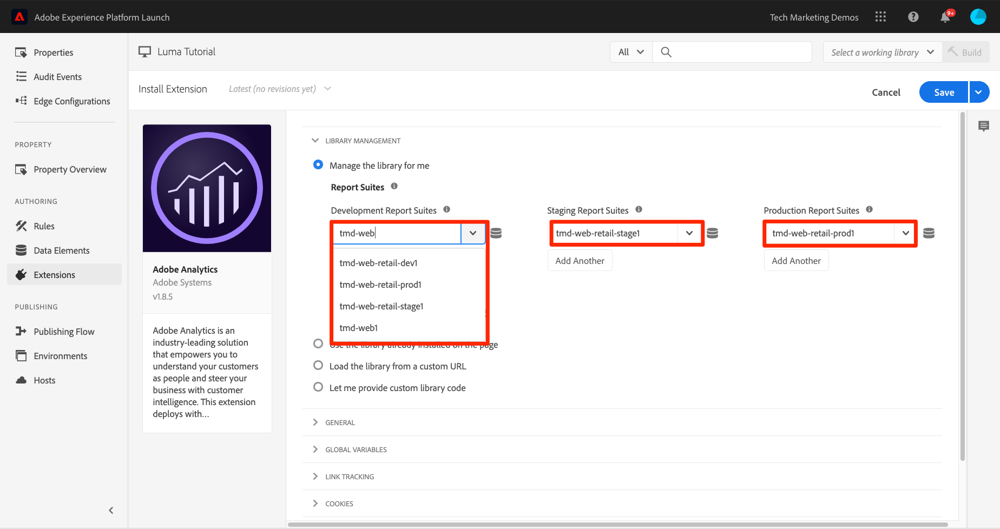
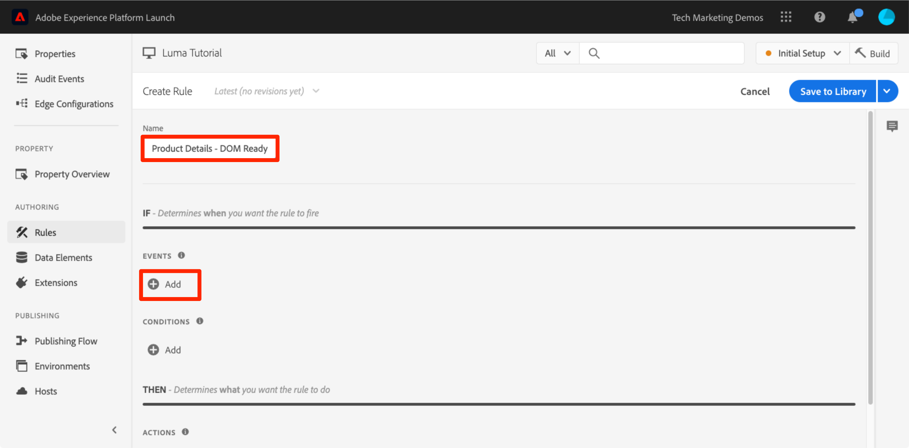
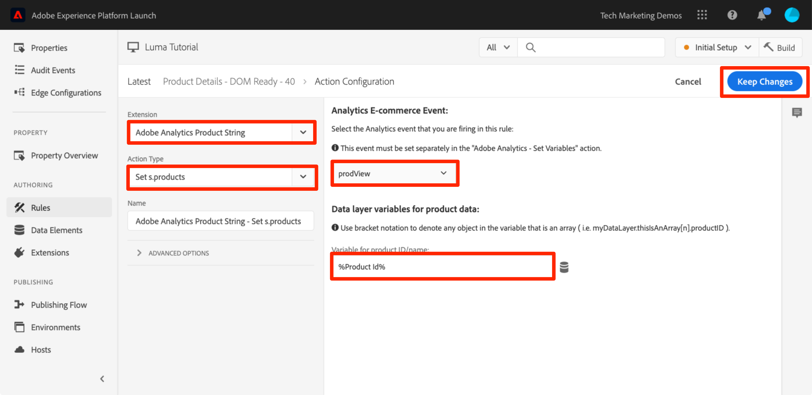
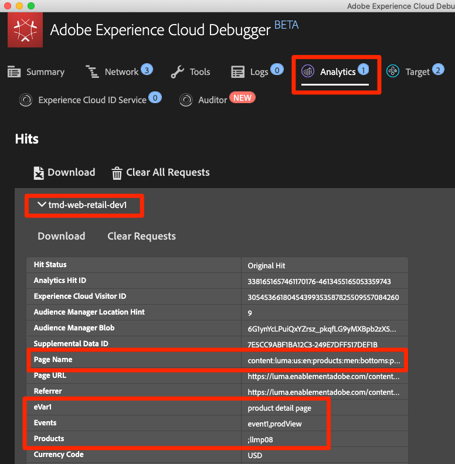
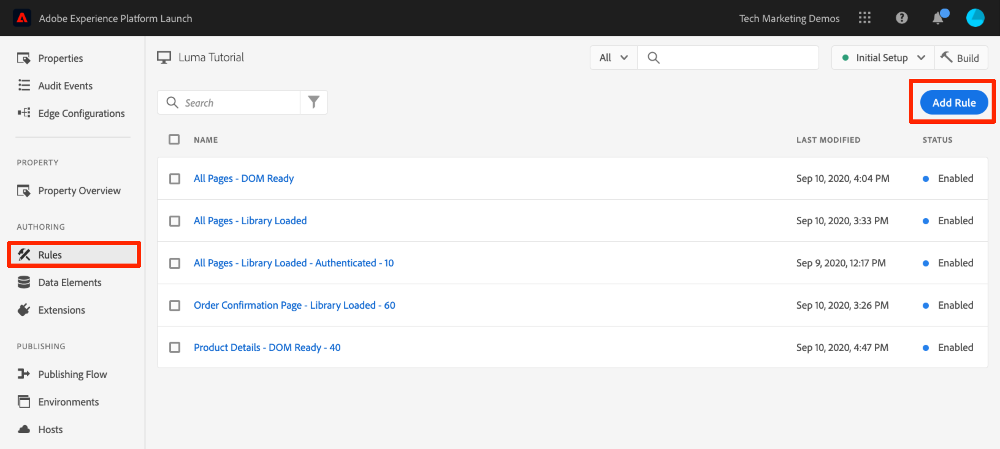

# Hinzufügen von Adobe Analytics

In dieser Lektion implementieren Sie die [Adobe Analytics-Erweiterung](https://experienceleague.adobe.com/docs/experience-platform/tags/extensions/adobe/analytics/overview.html) und erstellen Regeln, um Daten an Adobe Analytics zu senden.

[Adobe Analytics](https://experienceleague.adobe.com/docs/analytics.html?lang=de) ist eine branchenführende Lösung, mit der Sie Ihre Kunden besser verstehen und Ihr Geschäft mit Customer Intelligence steuern können.

>[!NOTE]
>
>Adobe Experience Platform Launch wird als eine Suite von Datenerfassungstechnologien in Adobe Experience Platform integriert. In der Benutzeroberfläche wurden verschiedene terminologische Änderungen eingeführt, die Sie bei der Verwendung dieses Inhalts beachten sollten:
>
> * Platform launch (Client-seitig) ist jetzt **[[!DNL tags]](https://experienceleague.adobe.com/docs/experience-platform/tags/home.html?lang=de)**
> * Platform launch Server Side ist jetzt **[[!DNL event forwarding]](https://experienceleague.adobe.com/docs/experience-platform/tags/event-forwarding/overview.html)**
> * Edge-Konfigurationen sind jetzt **[[!DNL datastreams]](https://experienceleague.adobe.com/docs/experience-platform/edge/fundamentals/datastreams.html?lang=de)**

## Lernziele

Am Ende dieser Lektion können Sie:

1. die Adobe Analytics-Erweiterung hinzufügen
1. Globale Variablen mithilfe der Erweiterung festlegen
1. Das Seitenansichts-Beacon hinzufügen
1. Zusätzliche Variablen mithilfe von Regeln hinzufügen
1. Klicktracking und andere ereignisbasierte Beacons hinzufügen
1. Analytics-Plugins hinzufügen

Es gibt viele Elemente, die für Analytics in -Tags implementiert werden können. In dieser Lektion werden nicht alle Elemente aufgezählt, sie bietet aber einen umfassenden Überblick über die wichtigsten Verfahren zur Implementierung auf Ihrer eigenen Site.

## Voraussetzungen

Sie sollten die Lektionen in [Konfigurieren von Tags](create-a-property.md) und [Hinzufügen des ID-Dienstes](id-service.md) bereits abgeschlossen haben.

Darüber hinaus benötigen Sie mindestens eine Report Suite-ID sowie Ihren Trackingserver. Wenn Sie nicht über eine Report Suite für Tests/Entwicklung verfügen, die Sie für dieses Tutorial verwenden können, erstellen Sie eine. Weitere Hilfestellung und Anweisungen finden Sie in der [Dokumentation](https://experienceleague.adobe.com/docs/analytics/admin/manage-report-suites/new-report-suite/new-report-suite.html?lang=de). Sie können Ihren Trackingserver aus Ihrer aktuellen Implementierung abrufen oder bei Ihrem Adobe-Berater oder Kundenbetreuer erfragen.

## Hinzufügen der Analytics-Erweiterung

Die Analytics-Erweiterung besteht aus zwei Hauptteilen:

1. Die Konfiguration der Erweiterung, die die grundlegenden Bibliothekseinstellungen von AppMeasurement.js verwaltet und globale Variablen festlegen kann
1. Regelaktionen für folgende Funktionen:
   1. Variablen festlegen
   1. Variablen löschen
   1. Analytics-Beacon senden

**Hinzufügen der Analytics-Erweiterung**

1. Navigieren Sie zu **[!UICONTROL Erweiterungen > Katalog]** .
1. Suchen Sie nach der Adobe Analytics-Erweiterung.
1. Klicken Sie auf **[!UICONTROL Installieren]** .

   

1. Geben Sie unter [!UICONTROL Bibliotheksverwaltung > Report Suites] die Report Suite-IDs ein, die Sie für jede Tag-Umgebung verwenden möchten. Wenn Ihre Benutzer Zugriff auf Adobe Analytics haben, beachten Sie, dass beim Eingeben des Felds eine vorab ausgefüllte Liste aller Report Suites angezeigt wird. (In diesem Tutorial können Sie eine Report Suite für alle Umgebungen verwenden. Doch in der Praxis sollten Sie verschiedene Report Suites verwenden, wie in der Abbildung unten gezeigt.)

   

   >[!TIP]
   >
   >Es wird empfohlen, die Option &quot;[!UICONTROL Bibliothek für mich verwalten]&quot;als Einstellung &quot;[!UICONTROL Bibliotheksverwaltung]&quot;zu verwenden, da es wesentlich einfacher ist, die `AppMeasurement.js` -Bibliothek auf dem neuesten Stand zu halten.

1. Geben Sie unter [!UICONTROL Allgemein > Tracking-Server] Ihren Tracking-Server ein, z. B. `tmd.sc.omtrdc.net`. Geben Sie Ihren SSL-Trackingserver ein, wenn Ihre Site `https://` unterstützt.

   

1. Legen Sie im Abschnitt [!UICONTROL Globale Variablen] unter [!UICONTROL Zusätzliche Einstellungen] die Variable [!UICONTROL Seitenname] mithilfe Ihres `Page Name` -Datenelements fest. Klicken Sie auf das Symbol , um das Modal zu öffnen und das `Page Name`-Seitendatenelement auszuwählen.

1. Klicken Sie auf **[!UICONTROL In Bibliothek speichern]**

   

>[!NOTE]
>
>Globale Variablen können in der Erweiterungskonfiguration oder in Regelaktionen festgelegt werden. Beachten Sie, dass beim Festlegen von Variablen in der Erweiterungskonfiguration die Datenschicht *vor* den Tag-Einbettungscodes definiert werden muss.

## Senden des Seitenansichts-Beacons

Nun erstellen Sie eine Regel, die das Analytics-Beacon auslöst, das die in der Erweiterungskonfiguration festgelegte Variable [!UICONTROL Seitenname] sendet.

Sie haben die Regel &quot;Alle Seiten - Bibliothek geladen&quot;bereits in der Lektion [Hinzufügen eines Datenelements, einer Regel und einer Bibliothek](add-data-elements-rules.md) dieses Tutorials erstellt, die auf jeder Seite ausgelöst wird, wenn die Tag-Bibliothek geladen wird. Sie *könnten* diese Regel auch für Analytics verwenden. Bei diesem Setup müssen jedoch alle im Analytics-Beacon verwendeten Datenschichtattribute vor den Tag-Einbettungscodes definiert werden. Um Daten flexibler erfassen zu können, erstellen Sie die neue Regel „Alle Seiten“, die bei „DOM bereit“ ausgelöst wird und wiederum das Analytics-Beacon aktiviert.

**Senden des Seitenansichts-Beacons**

1. Wechseln Sie zum Abschnitt **[!UICONTROL Regeln]** im linken Navigationsbereich und klicken Sie dann auf **[!UICONTROL Regel hinzufügen]** .

   

1. Geben Sie einen Namen für die Regel ein `All Pages - DOM Ready`.
1. Klicken Sie auf **[!UICONTROL Ereignisse > Hinzufügen]** , um den Bildschirm `Event Configuration` zu öffnen.

   

1. Wählen Sie **[!UICONTROL Ereignistyp > DOM bereit]** aus (Beachten Sie, dass die Reihenfolge der Regel &quot;50&quot;lautet).
1. Klicken Sie auf **[!UICONTROL Änderungen beibehalten]**
   

1. Klicken Sie unter „Aktionen“ auf , um eine neue Aktion hinzuzufügen.

   

1. Wählen Sie **[!UICONTROL Erweiterung > Adobe Analytics]** aus

1. Wählen Sie **[!UICONTROL Aktionstyp > Beacon senden]** aus.

1. Behalten Sie bei „Tracking“ `s.t()` bei. Beachten Sie: Wenn Sie einen `s.tl()`-Aufruf in einer Klickereignis-Regel vornehmen möchten, können Sie auch die Aktion „Beacon senden“ verwenden.

1. Klicken Sie auf die Schaltfläche **[!UICONTROL Änderungen beibehalten]**

   

1. Klicken Sie auf **[!UICONTROL In Bibliothek speichern und erstellen]**

   

### Überprüfen des Seitenansichts-Beacons

Nachdem Sie eine Regel zum Senden eines Analytics-Beacons erstellt haben, sollte die Anfrage in Experience Cloud Debugger angezeigt werden.

1. Öffnen Sie die [Site „Luma“](https://luma.enablementadobe.com/content/luma/us/en.html) in Ihrem Chrome-Browser.
1. Klicken Sie auf das Debugger-Symbol  , um den **[!UICONTROL Adobe Experience Cloud Debugger]** zu öffnen.
1. Stellen Sie sicher, dass der Debugger die Tag-Eigenschaft *Ihrer* Entwicklungsumgebung zuordnet, wie in der [früheren Lektion](switch-environments.md) beschrieben.

   

1. Klicken Sie, um die Registerkarte „Analytics“ zu öffnen.
1. Erweitern Sie den Namen Ihrer Report Suite, um alle Anfragen anzuzeigen.
1. Vergewissern Sie sich, dass die Anfrage mit der Variablen „Seitenname“ und dem zugehörigen Wert ausgelöst wurde.

   

>[!NOTE]
>
>Wenn der Seitenname für Sie nicht angezeigt wird, gehen Sie die Schritte auf dieser Seite durch, um sicherzustellen, dass Sie nichts übersehen haben.

## Hinzufügen von Variablen mit Regeln

Als Sie die Analytics-Erweiterung konfiguriert haben, haben Sie die `pageName`-Variable in der Erweiterungskonfiguration eingegeben. Dies ist ein guter Speicherort zum Ausfüllen anderer globaler Variablen wie eVars und props, sofern der Wert auf der Seite verfügbar ist, bevor der Tag-Einbettungscode geladen wird.

Flexibler können Variablen und Ereignissen in Regeln mithilfe der Aktion `Set Variables` festgelegt werden. Regeln ermöglichen es Ihnen, unter verschiedenen Bedingungen verschiedene Analysen-Variablen und -Ereignisse festzulegen. Sie könnten beispielsweise das `prodView`-Ereignis nur auf Produktdetailseiten und das `purchase`-Ereignis nur auf Bestellbestätigungsseiten festlegen. In diesem Abschnitt lernen Sie, wie Variablen mithilfe von Regeln festgelegt werden.

### Anwendungsfall

Produktdetailseiten sind wichtige Punkte für die Datenerfassung auf Einzelhandelssites. Normalerweise möchten Sie, dass Analytics registriert, wenn ein Produkt aufgerufen wird und um welches Produkt es sich gehandelt hat. Das ist hilfreich, um zu ermitteln, welche Produkte bei Ihren Kunden beliebt sind. Auf einer Mediensite können Sie für Artikel- und Videoseiten ähnliche Trackingmethoden wie die hier genutzten verwenden.  Beim Laden einer Produktdetailseite könnten Sie diesen Wert in einer „Seitentyp“-`eVar` ablegen und einige Ereignisse sowie die Produkt-ID festlegen. So können wir in unserer Analyse Folgendes ermitteln:

1. Wie oft werden Produktdetailseiten geladen
1. Welche spezifischen Produkte werden angezeigt und wie oft
1. Inwiefern beeinflussen andere Faktoren (Kampagnen, Suche usw.), wie viele Produktdetailseiten Kunden laden

### Erstellen eines Datenelements für den Seitentyp

Zunächst muss erkennbar sein, welche Seiten Produktdetailseiten sind. Dies erfolgt über ein Datenelement.

**Erstellen des Datenelements für den Seitentyp**

1. Klicken Sie im linken Navigationsbereich auf **[!UICONTROL Datenelemente]** .
1. Klicken Sie auf **[!UICONTROL Datenelement hinzufügen]**

   

1. Nennen Sie das Datenelement `Page Type`.
1. Wählen Sie **[!UICONTROL Datenelementtyp > JavaScript-Variable]** aus.
1. Verwenden Sie `digitalData.page.category.type` als **[!UICONTROL JavaScript-Variablennamen]**
1. Aktivieren Sie die Optionen **[!UICONTROL Text bereinigen]** und **[!UICONTROL Kleinbuchstaben erzwingen]** .
1. Klicken Sie auf **[!UICONTROL In Bibliothek speichern]**

   

### Erstellen eines Datenelements für die Produkt-ID

Erfassen Sie als Nächstes die Produkt-ID der aktuellen Produktdetailseite mit einem Datenelement.

**Erstellen des Datenelements für die Produkt-ID**

1. Klicken Sie im linken Navigationsbereich auf **[!UICONTROL Datenelemente]** .
1. Klicken Sie auf **[!UICONTROL Datenelement hinzufügen]**

   

1. Nennen Sie das Datenelement `Product Id`.
1. Wählen Sie **[!UICONTROL Datenelementtyp > JavaScript-Variable]** aus.
1. Verwenden Sie `digitalData.product.0.productInfo.sku` als **[!UICONTROL JavaScript-Variablennamen]**
1. Aktivieren Sie die Optionen **[!UICONTROL Text bereinigen]** und **[!UICONTROL Kleinbuchstaben erzwingen]** .
1. Klicken Sie auf **[!UICONTROL In Bibliothek speichern]**

   

### Hinzufügen der Adobe Analytics-Erweiterung „Produktzeichenfolge“

Wenn Sie bereits mit Adobe Analytics-Implementierungen vertraut sind, ist Ihnen die [Produktvariable](https://experienceleague.adobe.com/docs/analytics/implementation/vars/page-vars/products.html?lang=de) wahrscheinlich bekannt. Die Produktvariable verfügt über eine sehr spezielle Syntax und wird je nach Kontext auf unterschiedliche Weise verwendet. Um die Population der Produktvariablen in Tags zu vereinfachen, wurden bereits drei zusätzliche Erweiterungen im Marketplace für Tag-Erweiterungen erstellt. In diesem Abschnitt fügen Sie eine von Adobe Consulting erstellte Erweiterung für die Verwendung auf der Produktdetailseite hinzu.

**Hinzufügen der `Adobe Analytics Product String`-Erweiterung**

1. Navigieren Sie zur Seite [!UICONTROL Erweiterungen > Katalog].
1. Suchen Sie die Erweiterung `Adobe Analytics Product String` von Adobe Consulting Services und klicken Sie auf **[!UICONTROL Installieren]** .
   
1. Nehmen Sie sich einen Moment Zeit, um die Anweisungen zu lesen.
1. Klicken Sie auf **[!UICONTROL In Bibliothek speichern]**

   

### Erstellen von Regeln für Produktdetailseiten

Verwenden Sie jetzt Ihre neuen Datenelemente und Erweiterungen, um die Regel für die Produktdetailseite zu erstellen. Für diese Funktion werden Sie eine weitere Seitenladeregel erstellen, die von „DOM bereit“ ausgelöst wird. Sie werden dazu jedoch eine Bedingung verwenden, damit diese Regel nur auf den Produktdetailseiten ausgelöst wird und die Reihenfolge so festgelegt ist, dass sie _vor_ der Regel ausgelöst wird, durch die das Beacon gesendet wird.

**Erstellen der Seitenregel für Produktdetails**

1. Wechseln Sie zum Abschnitt **[!UICONTROL Regeln]** im linken Navigationsbereich und klicken Sie dann auf **[!UICONTROL Regel hinzufügen]** .

   

1. Geben Sie einen Namen für die Regel ein `Product Details - DOM Ready - 40`.
1. Klicken Sie auf **[!UICONTROL Ereignisse > Hinzufügen]** , um den Bildschirm `Event Configuration` zu öffnen.

   

1. Wählen Sie **[!UICONTROL Ereignistyp > DOM bereit]** aus.
1. Setzen Sie die **[!UICONTROL Reihenfolge]** auf 40, damit die Regel *vor* für die Regel mit der Aktion &quot;Analytics&quot;> &quot;Beacon senden&quot;ausgeführt wird.
1. Klicken Sie auf **[!UICONTROL Änderungen beibehalten]**
   

1. Klicken Sie unter &quot;**[!UICONTROL Bedingungen]**&quot;auf das Symbol &quot;&quot;, um den Bildschirm `Condition Configuration` zu öffnen.
   

   1. Wählen Sie **[!UICONTROL Bedingungstyp > Wertvergleich]** aus.
   1. Verwenden Sie die Datenelementauswahl und wählen Sie im ersten Feld `Page Type` aus.
   1. Wählen Sie **[!UICONTROL Enthält]** aus dem Dropdown-Menü für den Vergleichsoperator aus.
   1. Geben Sie in das nächsten Feld `product-page` ein (dies ist der eindeutige Teil des Seitentypwerts, der aus der Datenschicht der Produktdetailseiten abgerufen wird).
   1. Klicken Sie auf **[!UICONTROL Änderungen beibehalten]**

      

1. Klicken Sie unter „Aktionen“ auf , um eine neue Aktion hinzuzufügen.

   

1. Wählen Sie **[!UICONTROL Erweiterung > Adobe Analytics Product String]** aus
1. Wählen Sie **[!UICONTROL Aktionstyp > s.products festlegen]** aus.

1. Wählen Sie im Abschnitt **[!UICONTROL Analytics E-Commerce-Ereignis]** die Option **[!UICONTROL prodView]** aus.

1. Verwenden Sie im Abschnitt **[!UICONTROL Datenschichtvariablen für Produktdaten]** die Datenelementauswahl, um das Datenelement `Product Id` auszuwählen.

1. Klicken Sie auf **[!UICONTROL Änderungen beibehalten]**

   


1. Klicken Sie unter „Aktionen“ auf , um eine neue Aktion hinzuzufügen.

   

1. Wählen Sie **[!UICONTROL Erweiterung > Adobe Analytics]** aus
1. Wählen Sie **[!UICONTROL Aktionstyp > Variablen festlegen]** aus.
1. Wählen Sie **[!UICONTROL eVar1 > Als]** festlegen und geben Sie `product detail page` ein.
1. Legen Sie **[!UICONTROL event1]** fest, wobei die optionalen Werte leer bleiben.
1. Klicken Sie unter &quot;Ereignisse&quot;auf die Schaltfläche **[!UICONTROL Weitere hinzufügen]** .
1. Setzen Sie das Ereignis **[!UICONTROL prodView]**, wobei die optionalen Werte leer bleiben
1. Klicken Sie auf **[!UICONTROL Änderungen beibehalten]**

   

1. Klicken Sie auf **[!UICONTROL In Bibliothek speichern und erstellen]**

   

### Validieren der Daten der Produktdetailseite

Sie haben gerade eine Regel erstellt, die Variablen festlegt, bevor das Beacon gesendet wird. Jetzt sollten die im Treffer ausgehenden neuen Daten im Experience Cloud Debugger angezeigt werden.

**Überprüfen der Daten der Produktdetailseite**

1. Öffnen Sie die [Site „Luma“](https://luma.enablementadobe.com/content/luma/us/en.html) in Ihrem Chrome-Browser.
1. Navigieren Sie zu einer beliebigen Produktdetailseite.
1. Klicken Sie auf das Debugger-Symbol  , um den **[!UICONTROL Adobe Experience Cloud Debugger]** zu öffnen.
1. Klicken Sie auf die Registerkarte „Analytics“.
1. Erweitern Sie Ihre Report Suite.
1. Beachten Sie die Produktdetailvariablen, die sich jetzt im Debugger befinden: `eVar1` wurde auf „product detail page“ festgelegt, die `Events`-Variable auf „event1“ und „prodView“, die Produktvariable auf die Produkt-ID des anzuzeigenden Produkts und der Seitenname weiterhin auf die Analytics-Erweiterung.

   

## Senden eines „Link verfolgen“-Beacons

Wenn eine Seite geladen wird, löst sie normalerweise über die Funktion `s.t()` ein Seitenlade-Beacon aus. Dadurch wird automatisch die `page view`-Metrik für die jeweilige Seite erhöht, die in der `pageName`-Variablen aufgeführt ist.

Manchmal möchten Sie jedoch nicht die Seitenansichten Ihrer Site erhöhen, da die Aktion, die stattfindet, „kleiner“ (oder eventuell nur anders) ist als ein Seitenaufruf. Verwenden Sie in diesem Fall die Funktion `s.tl()`, die häufig als „Link verfolgen“-Anfrage bezeichnet wird. Die „Link verfolgen“-Anfrage muss jedoch trotz ihres Namens nicht beim Aufrufen eines Links ausgelöst werden. Sie kann durch *beliebige* der Ereignisse ausgelöst werden, die Ihnen im Tag Rule Builder zur Verfügung stehen, einschließlich Ihres eigenen benutzerdefinierten JavaScript.

In diesem Tutorial lösen Sie einen `s.tl()`-Aufruf mithilfe eines der coolsten JavaScript-Ereignisse aus, einem `Enters Viewport`-Ereignis.

### Anwendungsfall

Für diesen Anwendungsfall möchten Sie wissen, ob Benutzer auf unserer Luma-Startseite nach unten scrollen, um den Abschnitt &quot;*Empfohlene Produkte*&quot;auf unserer Seite zu sehen. Im Unternehmen herrscht Uneinigkeit darüber, ob Benutzer diesen Abschnitt überhaupt sehen oder nicht. Daher sollten Sie Analytics verwenden, um die Wahrheit zu ermitteln.

### Erstellen der Regel in Tags

1. Wechseln Sie zum Abschnitt **[!UICONTROL Regeln]** im linken Navigationsbereich und klicken Sie dann auf **[!UICONTROL Regel hinzufügen]** .
   
1. Geben Sie einen Namen für die Regel ein `Homepage - Featured Products enters Viewport`.
1. Klicken Sie auf **[!UICONTROL Ereignisse > Hinzufügen]** , um den Bildschirm `Event Configuration` zu öffnen.

   

1. Wählen Sie **[!UICONTROL Ereignistyp > Enters Viewport]** aus. Dadurch wird ein Feld eingeblendet, in das Sie den CSS-Selektor eingeben müssen. Damit wird das Element auf Ihrer Seite identifiziert, das die Regel auslöst, wenn es in die Ansicht des Browsers gelangt.
1. Gehen Sie zurück zur Startseite von Luma und scrollen Sie nach unten zum Abschnitt &quot;Vorgestellte Produkte&quot;.
1. Klicken Sie mit der rechten Maustaste auf den Abstand zwischen dem Titel &quot;FEATURED PRODUCTS&quot;und den Elementen in diesem Abschnitt und wählen Sie `Inspect` aus dem Kontextmenü. Dies ermöglicht die Suche nach dem Element.
1. Suchen Sie direkt dort oder möglicherweise direkt unter dem ausgewählten Bereich nach einem „div“ mit `class="we-productgrid aem-GridColumn aem-GridColumn--default--12"`. Suchen Sie nach diesem Element.
1. Klicken Sie mit der rechten Maustaste auf dieses Element und wählen Sie **[!UICONTROL Kopieren > Selektor kopieren]**

   

1. Gehen Sie zurück zu den Tags und fügen Sie diesen Wert aus der Zwischenablage in das Feld `Elements matching the CSS selector` ein.
   1. Nebenbei bemerkt, entscheiden Sie, wie Sie CSS-Selektoren identifizieren können. Diese Methode ist ein wenig fehleranfällig, da durch bestimmte Änderungen auf der Seite der Selektor unbrauchbar werden kann. Beachten Sie dies bei der Verwendung von CSS-Selektoren in -Tags.
1. Klicken Sie auf **[!UICONTROL Änderungen beibehalten]**
   

1. Klicken Sie unter „Bedingungen“ auf , um eine neue Bedingung hinzuzufügen.
1. Wählen Sie **[!UICONTROL Bedingungstyp > Wertvergleich]** aus.
1. Verwenden Sie die Datenelementauswahl und wählen Sie im ersten Feld `Page Name` aus.
1. Wählen Sie **[!UICONTROL Gleich]** aus dem Dropdown-Menü für den Vergleichsoperator aus
1. Geben Sie in das nächste Feld `content:luma:us:en` ein (dies ist der Seitenname der Startseite, der aus der Datenschicht abgerufen wurde – diese Regel soll in unserem Beispiel nur auf der Startseite ausgeführt werden).
1. Klicken Sie auf **[!UICONTROL Änderungen beibehalten]**

   

1. Klicken Sie unter „Aktionen“ auf , um eine neue Aktion hinzuzufügen.
1. Wählen Sie **[!UICONTROL Erweiterung > Adobe Analytics]** aus
1. Wählen Sie **[!UICONTROL Aktionstyp > Variablen festlegen]** aus.
1. Stellen Sie `eVar3` auf `Home Page - Featured Products` ein.
1. Stellen Sie `prop3` auf `Home Page - Featured Products` ein.
1. Stellen Sie die `Events`-Variable auf `event3` ein.
1. Klicken Sie auf **[!UICONTROL Änderungen beibehalten]**

   

1. Klicken Sie unter „Aktionen“ auf , um eine weitere neue Aktion hinzuzufügen.

1. Wählen Sie **[!UICONTROL Erweiterung > Adobe Analytics]** aus
1. Wählen Sie **[!UICONTROL Aktionstyp > Beacon senden]** aus.
1. Wählen Sie die Tracking-Option **[!UICONTROL `s.tl()`]** aus
1. Geben Sie im Feld **[!UICONTROL Linkname]** den Wert `Scrolled down to Featured Products` ein. Dieser Wert wird in den Bericht „Benutzerspezifische Links“ in Analytics eingefügt.
1. Klicken Sie auf **[!UICONTROL Änderungen beibehalten]**

   

1. Klicken Sie auf **[!UICONTROL In Bibliothek speichern und erstellen]**

   

### Überprüfen des „Link verfolgen“-Beacons

Nun sollten Sie sicherstellen, dass dieser Treffer eingeht, wenn Sie auf der Startseite nach unten zum Abschnitt &quot;Vorgestellte Produkte&quot;scrollen. Wenn Sie die Startseite zum ersten Mal laden, sollte die Anfrage nicht durchgeführt werden. Wenn Sie aber nach unten scrollen, sollte der Treffer mit den neuen Werten ausgelöst werden.

1. Öffnen Sie die [Site „Luma“](https://luma.enablementadobe.com/content/luma/us/en.html) in Ihrem Chrome-Browser und stellen Sie sicher, dass Sie sich oben auf der Startseite befinden.
1. Klicken Sie auf das Symbol **[!UICONTROL Debugger]**  , um den [!UICONTROL Adobe Experience Cloud Debugger] zu öffnen.
1. Klicken Sie auf die Registerkarte „Analytics“.
1. Erweitern Sie den Treffer Ihrer Report Suite.
1. Beachten Sie den normalen Seitenansichtstreffer für die Startseite mit u. a. dem Seitennamen (für eVar3 oder prop3 sind aber keine Einträge vorhanden).

   

1. Lassen Sie den Debugger geöffnet, scrollen Sie auf Ihrer Site nach unten, bis Sie den Abschnitt &quot;Vorgestellte Produkte&quot;sehen.
1. Rufen Sie den Debugger erneut auf. Jetzt sollte ein weiterer Analytics-Treffer angezeigt werden. Dieser Treffer sollte die Parameter des den von Ihnen eingerichteten s.tl()-Treffers enthalten:
   1. `LinkType = "link_o"` (das bedeutet, dass es sich bei dem Treffer um einen benutzerspezifischen Link handelt, nicht um einen Seitenansichtstreffer)
   1. `LinkName = "Scrolled down to Featured Products"`
   1. `prop3 = "Home Page - Featured Products"`
   1. `eVar3 = "Home Page - Featured Products"`
   1. `Events = "event3"`

      

## Hinzufügen eines Plugins

Ein Plugin ist ein JavaScript-Code, den Sie Ihrer Implementierung hinzufügen können, um eine spezifische Funktion auszuführen, die nicht in das Produkt integriert ist. Plugins können von Ihnen, anderen Adobe-Kunden/-Partnern oder von Adobe Consulting erstellt werden.

Zur Implementierung von Plugins sind drei Schritte erforderlich:

1. Integrieren Sie die Funktion „doPlugins“, in der auf das Plugin verwiesen wird.
1. Fügen Sie den Hauptfunktionscode für das Plugin hinzu.
1. Fügen Sie den Code ein, der die Funktion aufruft, die Variablen festlegt usw.

### Globale Verfügbarkeit des Analytics-Objekts

Wenn Sie die Funktion „doPlugins“ hinzufügen (siehe unten) und Plugins verwenden möchten, müssen Sie ein Kontrollkästchen aktivieren, um das s-Objekt von Analytics in der Analytics-Implementierung global verfügbar zu machen.

1. Navigieren Sie zu **[!UICONTROL Erweiterungen > Installiert]** .

1. Klicken Sie in der Adobe Analytics-Erweiterung auf **[!UICONTROL Konfigurieren]** .

   

1. Wählen Sie unter **[!UICONTROL Bibliotheksverwaltung]** das Feld mit der Bezeichnung `Make tracker globally accessible` aus. Wie Sie der Hilfemeldung entnehmen können, wird der Tracker hierdurch global unter „window.s“ geladen. Das ist wichtig, da Sie in Ihrem Kunden-JavaScript-Code darauf verweisen.
   

### Hinzufügen der Funktion „doPlugins“

Um Plugins hinzuzufügen, müssen Sie eine Funktion namens „doPlugins“ einfügen. Diese Funktion wird nicht standardmäßig hinzugefügt. Wird sie aber hinzugefügt, wird sie von der AppMeasurement-Bibliothek verarbeitet und zuletzt aufgerufen, wenn ein Treffer an Adobe Analytics gesendet wird. Daher können Sie diese Funktion verwenden, um JavaScript-Code auszuführen und so auf einfachere Weise Variablen festzulegen.

1. Scrollen Sie, während Sie sich noch in der Analytics-Erweiterung befinden, nach unten und erweitern Sie den Abschnitt mit dem Titel `Configure Tracker Using Custom Code.`
1. Klicken Sie auf **[!UICONTROL Editor öffnen]**
1. Fügen Sie den folgenden Code in den Code-Editor ein:

   ```javascript
   /* Plugin Config */
   s.usePlugins=true
   s.doPlugins=function(s) {
   /* Add calls to plugins here */
   }
   ```

1. Lassen Sie dieses Fenster für den nächsten Schritt geöffnet

### Hinzufügen des Funktionscodes für das Plugin

Sie werden in diesem Code zwei Plugins aufrufen, aber eines davon ist in der AppMeasurement-Bibliothek integriert, sodass Sie für dieses nicht die aufzurufende Funktion hinzufügen müssen. Für das zweite Plugin müssen Sie jedoch auch den Funktionscode hinzufügen. Es handelt sich um die Funktion getValOnce().

### Das getValOnce()-Plugin

Dieses Plugin soll verhindern, dass Werte fälschlicherweise im Code dupliziert werden, wenn ein Besucher eine Seite aktualisiert oder die Zurück-Schaltfläche des Browsers verwendet, um zu einer Seite zurückzukehren, auf der ein Wert festgelegt wurde. In dieser Lektion verwenden Sie es, um zu verhindern, dass das `clickthrough`-Ereignis dupliziert wird.

Der Code für dieses Plugin befindet sich in der [Analytics-Dokumentation](https://experienceleague.adobe.com/docs/analytics/implementation/vars/plugins/getvalonce.html) und ist hier zum einfachen Kopieren/Einfügen ebenfalls aufgeführt.

1. Kopieren Sie den folgenden Code:

   ```javascript
   /* Adobe Consulting Plugin: getValOnce v2.01 */
   s.getValOnce=function(vtc,cn,et,ep){if(vtc&&(cn=cn||"s_gvo",et=et||0,ep="m"===ep?6E4:864E5,vtc!==this.c_r(cn))){var e=new Date;e.setTime(e.getTime()+et*ep);this.c_w(cn,vtc,0===et?0:e);return vtc}return""};
   ```

1. Fügen Sie ihn im Codefenster in der Analytics-Erweiterung **unterhalb** der doPlugins-Funktion ein (nicht innerhalb davon). Wenn Sie das Fenster nicht mehr geöffnet haben, öffnen Sie es gemäß dem vorherigen Schritt erneut.

   

Sie können dieses Plugin jetzt aus „doPlugins“ heraus aufrufen.

### Aufrufen von Plugins aus doPlugins heraus

Der Code ist jetzt eingefügt und kann referenziert werden. Somit können Sie die Aufrufe an Plugins innerhalb der Funktion „doPlugins“ ausführen.

Rufen Sie zunächst ein Plugin auf, das in die AppMeasurement-Bibliothek integriert wurde und deshalb als „Dienstprogramm“ bezeichnet wird. Das Plugin trägt die Bezeichnung `s.Util.getQueryParam`, da es Teil des s-Objekts und ein integriertes Dienstprogramm ist und Werte basierend auf einem Parameter aus der Abfragezeichenfolge in der URL abruft.

1. Kopieren Sie den folgenden Code:

   ```javascript
   s.campaign = s.Util.getQueryParam("cid");
   ```

1. Fügen Sie ihn in die Funktion doPlugins ein. Hierdurch sucht die Funktion in der aktuellen Seiten-URL nach einem Parameter namens `cid` und fügt ihn in die Variable „s.campaign“ ein.
1. Rufen Sie jetzt die Funktion „getValOnce“ auf, indem Sie den folgenden Code kopieren und ihn direkt unterhalb des Aufrufs von „getQueryParam“ einfügen:

   ```javascript
   s.campaign=s.getValOnce(s.campaign,'s_cmp',30);
   ```

   Dieser Code stellt sicher, dass derselbe Wert innerhalb von 30 Tagen nur maximal ein Mal gesendet wird (siehe die Dokumentation für Möglichkeiten zur Anpassung dieses Codes an Ihre Bedürfnisse).

   

1. Speichern Sie das Codefenster.
1. Klicken Sie auf **[!UICONTROL In Bibliothek speichern und erstellen]**

   

### Überprüfen der Plugins

Jetzt können Sie sicherstellen, dass die Plugins funktionieren.

**Überprüfen der Plugins**

1. Öffnen Sie die [Site „Luma“](https://luma.enablementadobe.com/content/luma/us/en.html) in Ihrem Chrome-Browser.
1. Klicken Sie auf das Debugger-Symbol  , um den **[!UICONTROL Adobe Experience Cloud Debugger]** zu öffnen.
1. Klicken Sie auf die Registerkarte „Analytics“.
1. Erweitern Sie Ihre Report Suite.
1. Beachten Sie, dass im Analytics-Treffer keine Kampagnenvariable vorhanden ist.
1. Lassen Sie den Debugger geöffnet, kehren Sie zur Site „Luma“ zurück, fügen Sie `?cid=1234` zur URL hinzu und drücken Sie die Eingabetaste, um die Seite mit der hinzugefügten Abfragezeichenfolge zu aktualisieren.

   

1. Stellen Sie sicher, dass im Debugger eine zweite Analytics-Anfrage mit einer Kampagnenvariablen mit dem Wert `1234` vorhanden ist.

   

1. Kehren Sie zur Seite „Luma“ zurück und aktualisieren Sie sie erneut, wobei die Abfragezeichenfolge noch in der URL enthalten sein muss.
1. Überprüfen Sie den nächsten Treffer im Debugger. Die Kampagnenvariable sollte **nicht** vorhanden sein, da das getValOnce-Plugin sichergestellt hat, dass die Variable nicht dupliziert wird, und auch kein anderer Benutzer über den Kampagnen-Trackingcode erfasst wurde.

   

1. BONUS: Sie können dies wiederholt testen, indem Sie den Wert des Parameters `cid` in der Abfragezeichenfolge ändern. Die Kampagnenvariable sollte nur vorhanden sein, wenn sie die Seite **zum ersten Mal** mit dem jeweiligen Wert aufrufen. Wenn der Kampagnenwert nicht im Debugger angezeigt wird, ändern Sie einfach den Wert von `cid` in der Abfragezeichenfolge der URL und drücken Sie die Eingabetaste, um ihn wieder im Debugger anzuzeigen.

   >[!NOTE]
   >
   >Es gibt verschiedene Möglichkeiten, einen Parameter aus der Abfragezeichenfolge der URL abzurufen, darunter auch die Konfiguration der Analytics-Erweiterung. Die anderen Optionen – ohne Verwendung von Plugins – bieten jedoch nicht die Möglichkeit, unnötige Duplikate zu verhindern, wie wir es hier mit dem getValOnce-Plugin getan haben. Dies ist die bevorzugte Methode des Autors. Sie sollten aber selbst bestimmen, welche Methode für Sie und Ihre Bedürfnisse am besten geeignet ist.

Gut gemacht! Sie haben die Analytics-Lektion abgeschlossen. Natürlich gibt es noch viele andere Möglichkeiten, unsere Analytics-Implementierung zu verbessern. Hoffentlich haben Sie aber auch so einige der Kernkompetenzen erworben, um Ihren weiteren Bedarf zu decken.

[Weiter mit &quot;Adobe Audience Manager hinzufügen&quot;>](audience-manager.md)
