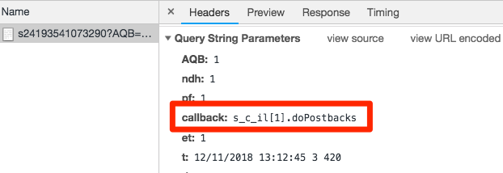

# Hinzufügen von Adobe Audience Manager

Diese Lektion führt Sie durch die Schritte zur Aktivierung von Adobe Audience Manager mithilfe der serverseitigen Weiterleitung.

[Wenn sie ihre Arbeit abgeschlossen haben, senden sie den Code an eine Staging-Umgebung, in der QA- und andere Teams ihn überprüfen können.](https://experienceleague.adobe.com/docs/audience-manager/user-guide/aam-home.html?lang=de)

>[!WARNING]
>
> Die in diesem Tutorial verwendete Luma-Website wird voraussichtlich in der Woche vom 16. Februar 2026 ersetzt. Die im Rahmen dieses Tutorials durchgeführten Arbeiten sind möglicherweise nicht auf die neue Website anwendbar.

>[!NOTE]
>
>Adobe Experience Platform Launch wird als eine Suite von Datenerfassungstechnologien in Adobe Experience Platform integriert. In der Benutzeroberfläche wurden mehrere terminologische Änderungen eingeführt, die Sie bei der Verwendung dieses Inhalts beachten sollten:
>
> * Platform Launch (Client-seitig) ist jetzt **[[!DNL tags]](https://experienceleague.adobe.com/docs/experience-platform/tags/home.html?lang=de)**
> * Platform Launch Server Side ist jetzt **[[!DNL event forwarding]](https://experienceleague.adobe.com/docs/experience-platform/tags/event-forwarding/overview.html)**
> * Edge-Konfigurationen sind jetzt **[[!DNL datastreams]](https://experienceleague.adobe.com/docs/experience-platform/edge/fundamentals/datastreams.html?lang=de)**

## Lernziele

Am Ende dieser Lektion können Sie:

1. die beiden Hauptmethoden zur Implementierung von Audience Manager auf einer Website beschreiben
1. Audience Manager über die serverseitige Weiterleitung des Analytics-Beacons hinzufügen
1. Implementierung von Audience Manager überprüfen

## Voraussetzungen

Um diese Lektion abzuschließen:

1. , um die Lektionen in &quot;[ Tags konfigurieren](create-a-property.md), [Adobe Analytics hinzufügen](analytics.md) und [Identity Service hinzufügen](id-service.md) abgeschlossen zu haben

1. benötigen Sie Administratorzugriff auf Adobe Analytics, damit Sie die serverseitige Weiterleitung für die Report Suite aktivieren können, die Sie für diese Übung verwenden. Alternativ können Sie auch einen Administrator in Ihrem Unternehmen bitten, dies anhand der unten stehenden Anleitung für Sie zu übernehmen.

1. Ihre &quot;Audience Manager-Subdomain“ (auch als „Partnername“, „Partner-ID“ oder „Partner-Subdomain“ bezeichnet). Wenn Sie Audience Manager bereits auf Ihrer eigentlichen Website implementiert haben, können Sie Audience Manager am einfachsten abrufen, indem Sie Ihre Website öffnen und den Debugger aufrufen. Die Unterdomäne finden Sie auf der Registerkarte „Zusammenfassung“ im Abschnitt „Audience Manager“:

   

Wenn Sie Audience Manager noch nicht implementiert haben, befolgen Sie diese Anleitung, um [Ihre Audience Manager-Subdomäne abzurufen](https://experienceleague.adobe.com/docs/audience-manager-learn/tutorials/web-implementation/how-to-identify-your-partner-id-or-subdomain.html).

## Implementierungsoptionen

Es gibt zwei Methoden zur Implementierung von Audience Manager auf einer Website:

* **Serverseitige Weiterleitung (Server-Side Forwarding, SSF):** Für Kunden mit Adobe Analytics ist dies die einfachste und empfohlene Implementierungsmethode. Adobe Analytics leitet Daten an AAM im Adobe-Backend weiter, um eine Anforderung weniger auf der Seite auszuführen. Darüber hinaus ermöglicht diese Methode wichtige Integrationsfunktionen und entspricht unseren Best Practices für die Implementierung und Bereitstellung von Audience Manager-Code.

* **Clientseitige Datenintegrationsbibliothek (Data Integration Library, DIL):** Dieser Ansatz richtet sich an Kunden, die nicht über Adobe Analytics verfügen. Der DIL-Code (AAM-JavaScript-Konfigurationscode) sendet Daten direkt von der Webseite an Audience Manager.

Da Sie Adobe Analytics bereits in diesem Tutorial bereitgestellt haben, stellen Sie Audience Manager mithilfe der serverseitigen Weiterleitung bereit. Eine vollständige Beschreibung sowie eine Liste der Anforderungen für die serverseitige Weiterleitung finden Sie in der entsprechenden [Dokumentation](https://experienceleague.adobe.com/docs/analytics/admin/admin-tools/server-side-forwarding/ssf.html?lang=de). Hier können Sie sich mit der Funktionsweise, den Anforderungen und möglichen Überprüfungen vertraut machen.

## Aktivieren der serverseitigen Weiterleitung

Zur SSF-Implementierung sind zwei Schritte erforderlich:

1. Aktivieren eines „Schalters“ in der Analytics-Admin Console, um *für jede Report Suite* Daten aus Analytics an Audience Manager weiterzuleiten.
1. Platzieren Sie den Code über Tags. Damit dies korrekt funktioniert, müssen die Adobe Experience Platform Identity Service-Erweiterung sowie die Analytics-Erweiterung installiert sein (Sie benötigen die AAM-Erweiterung eigentlich *nicht*, wie nachfolgend erklärt).

### Aktivieren der serverseitigen Weiterleitung in der Analytics-Admin Console

Eine Konfiguration in der Adobe Analytics-Admin Console ist erforderlich, um Daten von Adobe Analytics an Adobe Audience Manager weiterzuleiten. Da es bis zu vier Stunden dauern kann, bis die Weiterleitung der Daten beginnt, sollten Sie diesen Schritt zuerst durchführen.

#### Aktivieren der SSF in der Analytics-Admin Console

1. Melden Sie sich über die Experience Cloud-Benutzeroberfläche bei Analytics an. Wenn Sie keinen Administratorzugriff auf Analytics haben, ersuchen Sie Ihren Experience Cloud- oder Analytics-Administrator, Ihnen Zugriff zu gewähren oder diese Schritte für Sie auszuführen.

   

1. Wählen Sie in der oberen Navigationsleiste in Analytics **[!UICONTROL Admin > Report Suites]** und wählen Sie in der Liste die Report Suites aus, die Sie an Audience Manager weiterleiten möchten.

   

1. Wählen Sie auf dem Bildschirm Report Suites und bei ausgewählten Report Suites **[!UICONTROL Einstellungen bearbeiten > Allgemein > Server-seitige Weiterleitung]**.

   

   >[!WARNING]
   >
   >Wie bereits erwähnt, benötigen Sie Administratorrechte, um diesen Menüpunkt sehen zu können.

1. Lesen Sie auf der Seite Server-seitige Weiterleitung die Informationen und aktivieren Sie das Kontrollkästchen **[!UICONTROL Server-seitige Weiterleitung aktivieren]** für die Report Suites.

1. Klicken Sie auf **[!UICONTROL Speichern]**.

   

>[!NOTE]
>
>Da SSF pro Report Suite aktiviert werden muss, vergessen Sie nicht, diesen Schritt für Ihre echten Report Suites zu wiederholen, wenn Sie SSF auf der Report Suite Ihrer tatsächlichen Site bereitstellen.
>
>Wenn die SSF-Option ausgegraut ist, müssen Sie die Report Suite(s) auch Ihrer Experience Cloud-Organisation zuordnen, um die Option zu aktivieren. Dies wird in [der Dokumentation](https://experienceleague.adobe.com/docs/analytics/admin/data-governance/gdpr-view-settings.html) erläutert.

Sobald dieser Schritt abgeschlossen ist und Sie Adobe Experience Platform Identity Service aktiviert haben, werden die Daten von Analytics an AAM weitergeleitet. Um jedoch den Prozess abzuschließen, damit die Antwort von AAM korrekt auf die Seite (und auch über die Audience Analytics-Funktion auf Analytics) zurückkommt, müssen Sie auch den folgenden Schritt in Tags ausführen. Machen Sie sich keine Sorgen, das ist super einfach.

### Aktivieren der Server-seitigen Weiterleitung in Tags

Dies ist der zweite von zwei Schritten zur Aktivierung der SSF. Sie haben den Schalter in der Analytics-Admin Console bereits umgelegt, und jetzt müssen Sie nur den Code hinzufügen, was Tags für Sie tun, wenn Sie einfach das rechte Kontrollkästchen aktivieren.

>[!NOTE]
>
>Um die Server-seitige Weiterleitung von Analytics-Daten in AAM zu implementieren, bearbeiten/konfigurieren wir die Analytics-Erweiterung in Tags und **nicht** AAM-Erweiterung. Die AAM-Erweiterung wird ausschließlich für clientseitige DIL-Implementierungen verwendet, für diejenigen, die nicht über Adobe Analytics verfügen. Die folgenden Schritte sind daher korrekt, wenn Sie zur Einrichtung in die Analytics-Erweiterung gesendet werden.

#### So aktivieren Sie SSF in Tags

1. Navigieren Sie zu **[!UICONTROL Erweiterungen > Installiert]** und klicken Sie, um die Analytics-Erweiterung zu konfigurieren.

   

1. Erweitern Sie den `Adobe Audience Manager`-Abschnitt.

1. Aktivieren Sie das Kontrollkästchen **[!UICONTROL Analytics-Daten automatisch für Audience Manager freigeben]**. Dadurch wird das Audience Manager-“Modul“ (Code) der Implementierung von `AppMeasurement.js` von Analytics hinzufügt.

1. Fügen Sie Ihre Audience Manager-Subdomain hinzu (auch „Partnername“, „Partner-ID“ oder „Partner-Subdomain“ genannt). Befolgen Sie diese Anleitungen, um Ihre [Audience Manager-Unterdomäne abzurufen](https://experienceleague.adobe.com/docs/audience-manager-learn/tutorials/web-implementation/how-to-identify-your-partner-id-or-subdomain.html).

1. Klicken Sie auf **[!UICONTROL In Bibliothek speichern und erstellen]**

   

Der Code für die serverseitige Weiterleitung ist jetzt implementiert!

### Überprüfen der serverseitigen Weiterleitung

Die Hauptmethode zur Überprüfung der serverseitigen Weiterleitung besteht darin, sich die Antwort auf einen der Adobe Analytics-Treffer anzusehen. Dazu kommen wir gleich. In der Zwischenzeit sollten wir ein paar andere Dinge überprüfen, die uns helfen, sicherzustellen, dass sie so funktioniert, wie wir es wollen.

#### Überprüfen Sie, ob der Code korrekt geladen wird

Der Code, den Tags für die Weiterleitung installiert, insbesondere für die Antwort von AAM auf die Seite, wird als Audience Manager bezeichnet
„Modul“. Wir können Experience Cloud Debugger verwenden, um sicherzustellen, dass er geladen wurde.

1. Öffnen Sie die Site „Luma“.
1. Klicken Sie auf das Debugger-Symbol in Ihrem Browser, um den Experience Cloud Debugger zu öffnen.
1. Scrollen Sie auf der Registerkarte „Zusammenfassung“ nach unten zum Abschnitt „Analytics“.
1. Stellen Sie sicher, dass **AudienceManagement** im Bereich „Module“ aufgeführt ist.

   

#### Überprüfen der Partner-ID im Debugger

Als Nächstes können wir auch überprüfen, ob der Debugger die richtige „Partner-ID“ (auch Partner-Subdomain genannt) aus dem Code abruft.

1. Wenn Sie sich noch im Debugger befinden und auf der Registerkarte „Zusammenfassung“ befinden, scrollen Sie nach unten zum Abschnitt „Audience Manager“.
1. Überprüfen Sie die Partner-ID/Unterdomäne unter „Partner“.

   

>[!WARNING]
>
>Sie werden feststellen, dass der Abschnitt &quot;Audience Manager&quot; des Debuggers auf &quot;DIL&quot; verweist, was der &quot;Data Integration Library&quot; entspricht, und sich normalerweise auf eine Client-seitige Implementierung bezieht, im Gegensatz zum serverseitigen Ansatz, den wir hier implementiert haben. Die Wahrheit ist, dass das AAM-“Modul“ (in diesem SSF-Ansatz verwendet) eine Menge des gleichen Codes wie die clientseitige DIL-Bibliothek verwendet. Daher meldet dieser Debugger sie derzeit als solche. Wenn Sie die Schritte in diesem Tutorial ausgeführt haben und die übrigen Elemente in diesem Überprüfungsabschnitt korrekt sind, können Sie sicher sein, dass die serverseitige Weiterleitung funktioniert.

#### Überprüfen der Analytics-Anforderung und -Antwort

Das ist wichtig. Wenn Sie keine serverseitige Weiterleitung Ihrer Daten von Analytics an Audience Manager nutzen, wird keine Antwort auf das Analytics-Beacon gesendet (abgesehen von einem 2x2-Pixel). Wenn Sie jedoch SSF verwenden, können Sie verschiedene Elemente in der Analytics-Anforderung und -Antwort überprüfen, um sicherzustellen, dass alles ordnungsgemäß funktioniert.
Leider unterstützt Experience Cloud Debugger zu diesem Zeitpunkt nicht die Anzeige der Antworten auf die Beacons. Daher sollten Sie einen anderen Debugger/Paket-Sniffer verwenden, wie z. B. Charles Proxy oder die Entwicklertools des Browsers.

1. Öffnen Sie die Entwicklertools in Ihrem Browser und rufen Sie die Registerkarte „Netzwerk“ auf.
1. Geben Sie in das Filterfeld `b/ss` ein, wodurch die Anzeige auf die Adobe Analytics-Anforderungen beschränkt wird.
1. Aktualisieren Sie die Seite, um die Analytics-Anforderung anzuzeigen.

   

1. Suchen Sie im Analytics-Beacon (Anforderung) nach einem „callback“-Parameter. Er wird in etwa so aussehen: `s_c_il[1].doPostbacks`

   

1. Sie erhalten eine Antwort auf das Analytics-Beacon. Sie enthält Verweise auf „doPostbacks“, wie in der Anforderung aufgerufen. Vor allem sollte sie ein „stuff“-Objekt haben. Hier werden AAM-Segment-IDs zurück an den Browser gesendet. Wenn das „stuff“-Objekt vorhanden ist, funktioniert SSF!

   

>[!WARNING]
>
>Hüten Sie sich vor dem falschen „Erfolg“ - Wenn es eine Antwort gibt und alles zu funktionieren scheint, stellen Sie **sicher** dass Sie dieses „Zeug“-Objekt haben. Ist dieses Objekt nicht vorhanden, wird in der Antwort möglicherweise eine Meldung mit &quot;status&quot;:&quot;SUCCESS&quot; (Erfolg) angezeigt. Auch wenn dies unlogisch erscheint, ist das Beweis dafür, dass SSF **NICHT** richtig funktioniert. Wenn Sie dies sehen, bedeutet dies, dass Sie diesen zweiten Schritt (den Code in Tags) abgeschlossen haben, die Weiterleitung in Analytics Admin Console (erster Schritt dieses Abschnitts) jedoch noch nicht abgeschlossen haben. In diesem Fall müssen Sie überprüfen, dass Sie SSF in der Analytics-Admin Console aktiviert haben. Wenn das der Fall ist und noch keine vier Stunden vergangen sind, warten Sie entsprechend.

[Weiter &quot;Experience Cloud-Integrationen“ >](integrations.md)
