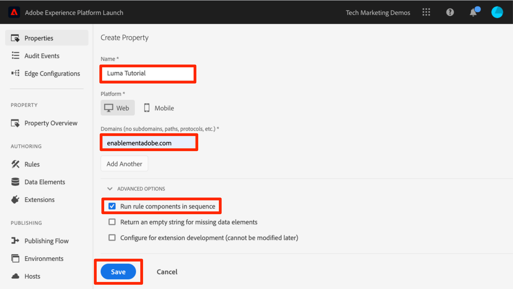

# Erstellen einer Tag-Eigenschaft

In dieser Lektion erstellen Sie Ihre erste Tag-Eigenschaft.

Eine Eigenschaft ist im Wesentlichen ein Container, den Sie bei der Bereitstellung von Tags auf Ihrer Site mit Erweiterungen, Regeln, Datenelementen und Bibliotheken füllen.

>[!WARNING]
>
> Die in diesem Tutorial verwendete Luma-Website wird voraussichtlich in der Woche vom 16. Februar 2026 ersetzt. Die im Rahmen dieses Tutorials durchgeführten Arbeiten sind möglicherweise nicht auf die neue Website anwendbar.

## Voraussetzungen

Um die nächsten Lektionen abzuschließen, benötigen Sie die Berechtigung zum Entwickeln, Genehmigen, Veröffentlichen, Verwalten von Erweiterungen und Verwalten von Umgebungen in Tags. Wenn Sie einen dieser Schritte nicht ausführen können, weil die Optionen in der Benutzeroberfläche nicht verfügbar sind, wenden Sie sich an Ihren Experience Cloud-Administrator, um den Zugriff anzufordern. Weitere Informationen zu Tag-Benutzerberechtigungen finden Sie unter [Dokumentation](https://experienceleague.adobe.com/docs/experience-platform/tags/admin/user-permissions.html?lang=de).

>[!NOTE]
>
>Adobe Experience Platform Launch wird als eine Suite von Datenerfassungstechnologien in Adobe Experience Platform integriert. In der Benutzeroberfläche wurden mehrere terminologische Änderungen eingeführt, die Sie bei der Verwendung dieses Inhalts beachten sollten:
>
> * Platform Launch (Client-seitig) ist jetzt **[[!DNL tags]](https://experienceleague.adobe.com/docs/experience-platform/tags/home.html?lang=de)**
> * Platform Launch Server Side ist jetzt **[[!DNL event forwarding]](https://experienceleague.adobe.com/docs/experience-platform/tags/event-forwarding/overview.html)**
> * Edge-Konfigurationen sind jetzt **[[!DNL datastreams]](https://experienceleague.adobe.com/docs/experience-platform/edge/fundamentals/datastreams.html?lang=de)**

## Lernziele

Am Ende dieser Lektion können Sie:

* Melden Sie sich bei der Datenerfassungs-Benutzeroberfläche an
* Erstellen einer neuen Tag-Eigenschaft
* Konfigurieren einer Tag-Eigenschaft

## Wechseln zur Datenerfassungs-Oberfläche

**So gelangen Sie zur Datenerfassung**

1. Melden Sie sich bei [Adobe Experience Cloud](https://experiencecloud.adobe.com) an.

1. Klicken Sie auf das , um den App Switcher zu öffnen

1. Wählen Sie **[!UICONTROL Launch/Datenerfassung]** aus dem Menü 

Hierdurch sollte der Bildschirm `Tags Properties` angezeigt werden (wenn keine Eigenschaften im Konto erstellt wurden, ist dieser Bildschirm möglicherweise leer):

## Erstellen einer Eigenschaft

Eine Eigenschaft ist im Wesentlichen ein Container, den Sie bei der Bereitstellung von Tags auf Ihrer Site mit Erweiterungen, Regeln, Datenelementen und Bibliotheken füllen. Es kann sich bei einer Eigenschaft um eine beliebige Gruppierung einer oder mehrerer Domains bzw. Subdomains handeln. Sie können diese Assets auf ähnliche Weise verwalten und verfolgen. Angenommen, Sie haben mehrere Websites, die auf einer Vorlage basieren, und Sie möchten auf all diesen Websites dieselben Assets verfolgen. Sie können eine Eigenschaft auf mehrere Domänen anwenden. Weitere Informationen zum Erstellen von Eigenschaften finden Sie unter [„Unternehmen und Eigenschaften“](https://experienceleague.adobe.com/docs/experience-platform/tags/admin/companies-and-properties.html?lang=de) in der Produktdokumentation.

**Erstellen einer Eigenschaft**

1. Klicken Sie auf **[!UICONTROL Schaltfläche „Neue Eigenschaft]**:

   

1. Benennen Sie Ihre Eigenschaft (z. B. `Luma Tutorial` oder `Luma Tutorial - Daniel`).
1. Geben Sie `enablementadobe.com` als Domain ein, da dies die Domain ist, in der die Demosite „Luma“ gehostet wird. Obwohl das Feld „Domain“ erforderlich ist, funktioniert die Tag-Eigenschaft in jeder Domain, in der sie implementiert ist. Der Hauptzweck dieses Felds ist die Vorbelegung von Menüpunkten im Regel-Builder.
1. Erweitern Sie den **[!UICONTROL Erweiterte Optionen]** und aktivieren Sie das Kontrollkästchen **[!UICONTROL Regelkomponenten nacheinander ausführen]**
1. Klicken Sie auf die Schaltfläche **[!UICONTROL Speichern]**

   

Ihre neue Eigenschaft sollte auf der Eigenschaftsseite angezeigt werden. Beachten Sie, dass, wenn Sie das Kontrollkästchen neben dem Eigenschaftsnamen aktivieren, die Optionen für **[!UICONTROL Konfigurieren]** oder **[!UICONTROL Löschen]** oberhalb der Eigenschaftenliste angezeigt werden. Klicken Sie auf den Namen Ihrer Eigenschaft (z. B. `Luma Tutorial`), um den `Overview` Bildschirm zu öffnen.

[Weiter „Fügen Sie den Einbettungs-Code hinzu“ >](add-embed-code.md)
