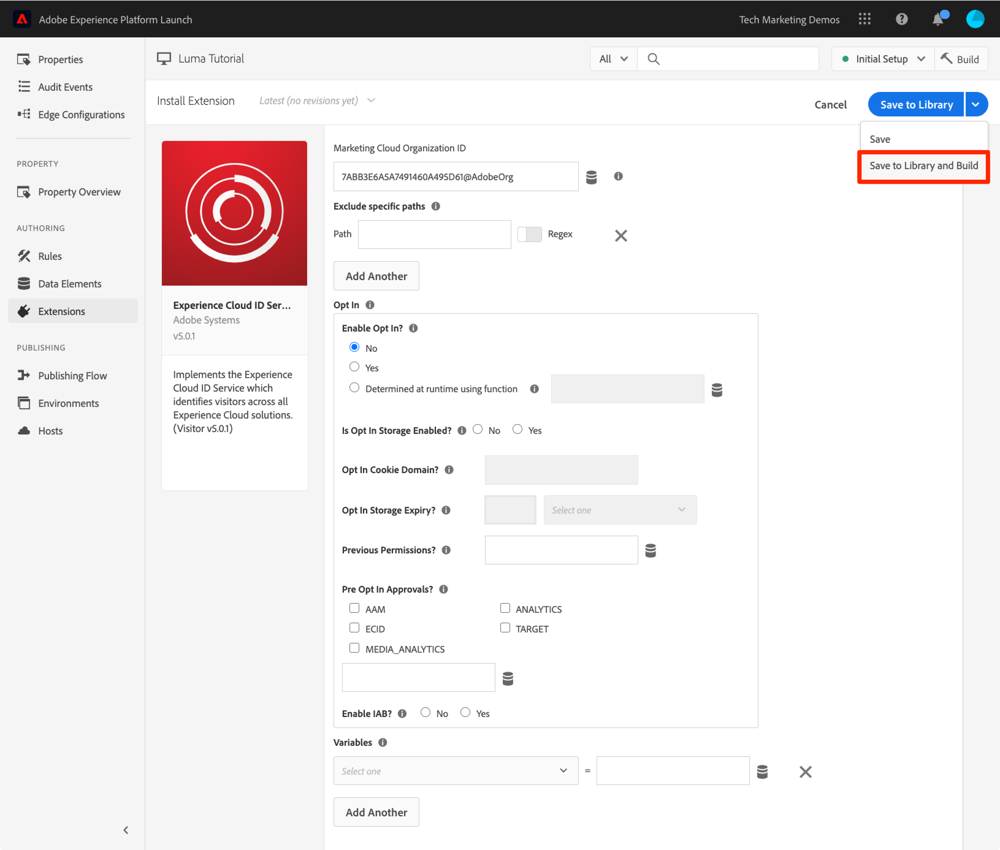
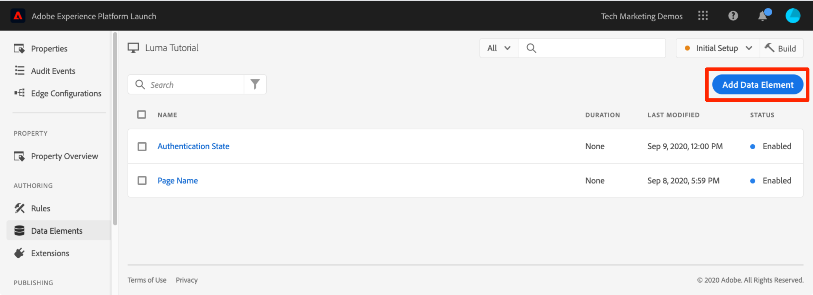
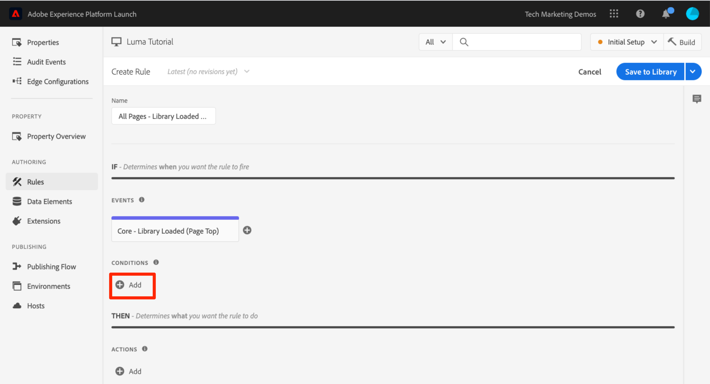
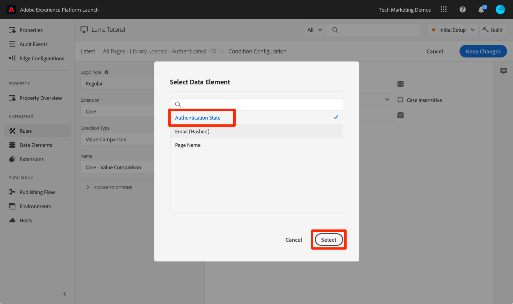

# Adobe Experience Platform Identity Service hinzufügen

Diese Lektion führt Sie durch die Schritte, die zur Implementierung der [Adobe Experience Platform Identity Service-Erweiterung](https://experienceleague.adobe.com/docs/experience-platform/tags/extensions/adobe/id-service/overview.html) und zum Senden von Kunden-IDs erforderlich sind.

Der [Adobe Experience Platform Identity Service](https://experienceleague.adobe.com/docs/id-service/using/home.html?lang=de) legt eine gemeinsame Besucher-ID für alle Adobe-Lösungen fest, um Experience Cloud-Funktionen wie die gemeinsame Nutzung von Audiences zwischen Lösungen zu ermöglichen. Sie können auch eigene Kunden-IDs an den Service senden, um geräteübergreifendes Targeting und die Integration in Ihr CRM (Customer Relationship Management)-System zu ermöglichen.


>[!WARNING]
>
> Die in diesem Tutorial verwendete Luma-Website wird voraussichtlich in der Woche vom 16. Februar 2026 ersetzt. Die im Rahmen dieses Tutorials durchgeführten Arbeiten sind möglicherweise nicht auf die neue Website anwendbar.

>[!NOTE]
>
>Adobe Experience Platform Launch wird als eine Suite von Datenerfassungstechnologien in Adobe Experience Platform integriert. In der Benutzeroberfläche wurden mehrere terminologische Änderungen eingeführt, die Sie bei der Verwendung dieses Inhalts beachten sollten:
>
> * Platform Launch (Client-seitig) ist jetzt **[[!DNL tags]](https://experienceleague.adobe.com/docs/experience-platform/tags/home.html?lang=de)**
> * Platform Launch Server Side ist jetzt **[[!DNL event forwarding]](https://experienceleague.adobe.com/docs/experience-platform/tags/event-forwarding/overview.html)**
> * Edge-Konfigurationen sind jetzt **[[!DNL datastreams]](https://experienceleague.adobe.com/docs/experience-platform/edge/fundamentals/datastreams.html?lang=de)**

## Lernziele

Am Ende dieser Lektion können Sie:

* Identity Service-Erweiterung hinzufügen
* ein Datenelement zur Erfassung Ihrer Kunden-IDs erstellen
* eine Regel erstellen, die die Aktion „Kunden-IDs festlegen“ verwendet, um die Kunden-IDs an Adobe zu senden
* die Sortierreihenfolge für Regeln verwenden, die beim selben Ereignis ausgelöst werden

## Voraussetzungen

Sie sollten die Lektionen bereits im Abschnitt [Konfigurieren von Tags](create-a-property.md) abgeschlossen haben.

## Identity Service-Erweiterung hinzufügen

Da dies die erste Erweiterung ist, die Sie hinzufügen, hier eine kurze Übersicht über Erweiterungen. Erweiterungen sind eine der Kernfunktionen von Tags. Eine Erweiterung ist eine Integration, die von Adobe, einem Adobe-Partner oder einem Adobe-Kunden erstellt wurde und zahllose neue Optionen für die Tags bietet, die Sie auf Ihren Websites bereitstellen können. Wenn Sie sich Tags als Betriebssystem vorstellen, sind Erweiterungen die Apps, die Sie installieren, damit Tags die Dinge tun können, die Sie tun müssen.

**Hinzufügen der Identity Service-Erweiterung**

1. Klicken Sie in der linken Navigation auf **[!UICONTROL Erweiterungen]**

1. Klicken Sie **[!UICONTROL Katalog]**, um zur Seite „Erweiterungskatalog“ zu wechseln

1. Beachten Sie die verschiedenen Erweiterungen, die im Katalog verfügbar sind.

1. Geben Sie oben im Filter „id“ ein, um den Katalog zu filtern.

1. Klicken Sie auf der Karte für den Adobe Experience Platform Identity Service auf **[!UICONTROL Installieren]**

   

1. Beachten Sie, dass Ihre Experience Cloud-Organisations-ID automatisch erkannt wird.

1. Belassen Sie alle Standardeinstellungen und klicken Sie auf **[!UICONTROL In Bibliothek speichern und erstellen]**

   

>[!NOTE]
>
>Jede Version der Identity Service-Erweiterung enthält eine bestimmte Version von VisitorAPI.js, die in der Beschreibung der Erweiterung aufgeführt ist. Sie aktualisieren die VisitorAPI.js-Version, indem Sie die Identity Service-Erweiterung aktualisieren.

### Überprüfen der Erweiterung

Die Identity Service-Erweiterung ist eine der wenigen Tag-Erweiterungen, die eine Anfrage stellt, ohne eine Regelaktion verwenden zu müssen. Die Erweiterung sendet beim ersten Seitenladevorgang des ersten Besuchs einer Website automatisch eine Anforderung an den Identity Service. Sobald die ID angefordert wurde, wird sie in einem Erstanbieter-Cookie gespeichert, das mit „AMCV_“ beginnt.

**Überprüfen der Identity Service-Erweiterung**

1. Öffnen Sie die [Site „Luma“](https://luma.enablementadobe.com/content/luma/us/en.html).

1. Stellen Sie sicher, dass der Debugger die Tag-Eigenschaft *Ihre* zuordnet, wie in der [&#x200B; Lektion &#x200B;](switch-environments.md).

1. Auf der Registerkarte Zusammenfassung des Debuggers sollte der Abschnitt Tags anzeigen, dass die Adobe Experience Platform Identity Service-Erweiterung implementiert ist.

1. Außerdem sollte der Abschnitt Identity Service auf der Registerkarte Zusammenfassung mit derselben Organisations-ID ausgefüllt werden, die sich auf dem Konfigurationsbildschirm Ihrer Erweiterung in der Datenerfassungs-Oberfläche befand:

   

1. Die erste Anforderung zum Abrufen der Besucher-ID wird möglicherweise auf der Registerkarte „Identity Service“ des Debuggers angezeigt. Sie wurde jedoch möglicherweise bereits angefordert; wenn sie also nicht angezeigt wird, ist dies kein Grund zur Sorge:
   

1. Nach der ersten Anforderung zum Abrufen der Besucher-ID wird die ID in einem Cookie gespeichert, dessen Name mit `AMCV_` beginnt. Sie können bestätigen, dass das Cookie festgelegt wurde, indem Sie wie folgt vorgehen:
   1. Öffnen Sie die Entwicklertools Ihres Browsers.
   1. Navigieren Sie zur Registerkarte `Application`.
   1. Erweitern Sie „`Cookies`“ auf der linken Seite.
   1. Klicken Sie auf die Domain `https://luma.enablementadobe.com`.
   1. Suchen Sie auf der rechten Seite nach dem „AMCV_“-Cookie. Möglicherweise sehen Sie mehrere , seit Sie die Luma-Site geladen haben, indem Sie sowohl ihre hartcodierte Tag-Eigenschaft als auch ihre eigene Eigenschaft zugeordnet haben.
      

Das ist alles! Sie haben Ihre erste Erweiterung hinzugefügt! Weitere Informationen zu den Konfigurationsoptionen des Identity Service finden Sie in [der Dokumentation](https://experienceleague.adobe.com/docs/id-service/using/id-service-api/configurations/function-vars.html?lang=de).

## Senden von Kunden-IDs

Als Nächstes senden Sie eine [Kunden-ID](https://experienceleague.adobe.com/docs/id-service/using/reference/authenticated-state.html) an den Identity Service. Dadurch können Sie [Ihr CRM in Experience Cloud integrieren](https://experienceleague.adobe.com/docs/core-services/interface/customer-attributes/attributes.html?lang=de) und Besucher geräteübergreifend verfolgen.

In der früheren Lektion [Hinzufügen von Datenelementen, Regeln und Bibliotheken](add-data-elements-rules.md) haben Sie ein Datenelement erstellt und in einer Regel verwendet. Jetzt werden Sie dieselben Methoden verwenden, um eine Kunden-ID zu senden, wenn der Besucher authentifiziert wird.

### Erstellen von Datenelementen für Kunden-IDs

Erstellen Sie zunächst zwei Datenelemente:

1. `Authentication State` zur Erfassung, ob der Besucher angemeldet ist oder nicht.
1. `Email (Hashed)` erfasst die gehashte Version der E-Mail-Adresse (als Kunden-ID verwendet) aus der Datenschicht.

**Erstellen des Datenelements für den Authentifizierungsstatus**

1. Klicken Sie **[!UICONTROL linken Navigationsbereich auf]** Datenelemente“
1. Klicken Sie auf **[!UICONTROL Schaltfläche „Datenelement]**&quot;

   

1. Benennen Sie das Datenelement `Authentication State`.
1. Wählen Sie für **[!UICONTROL Datenelementtyp]** die Option **[!UICONTROL Benutzerdefinierter Code]**
1. Klicken Sie auf **[!UICONTROL Schaltfläche]** Editor öffnen“

   

1. Verwenden Sie im Fenster [!UICONTROL Code bearbeiten] den folgenden Code, um die Werte „angemeldet“ oder „abgemeldet“ basierend auf einem Attribut in der Datenschicht der Site „Luma“ zurückzugeben:

   ```javascript
   if (digitalData.user[0].profile[0].attributes.loggedIn)
       return "logged in"
   else
       return "logged out"
   ```

1. Klicken Sie **[!UICONTROL Speichern]**, um den benutzerdefinierten Code zu speichern

   

1. Behalten Sie bei allen anderen Einstellungen die Standardwerte bei.
1. Klicken Sie **[!UICONTROL In Bibliothek speichern]**, um das Datenelement zu speichern und zur Seite „Datenelemente“ zurückzukehren. Wir müssen erst dann einen Build erstellen, wenn wir alle unsere Änderungen vorgenommen haben und bereit zur Validierung sind.

   

Indem Sie den Authentifizierungsstatus des Benutzers kennen, wissen Sie, wann eine Kunden-ID auf der Seite vorhanden sein sollte, die an den Identity Service gesendet werden kann. Der nächste Schritt besteht darin, ein Datenelement für die Kunden-ID selbst zu erstellen. Auf der Demosite „Luma“ verwenden Sie die gehashte Version der E-Mail-Adresse des Besuchers.

**Hinzufügen des Datenelements für die gehashte-E-Mail**

1. Klicken Sie auf **[!UICONTROL Schaltfläche „Datenelement]**&quot;

   

1. Benennen Sie das Datenelement `Email (Hashed)`.
1. Wählen Sie für **[!UICONTROL Datenelementtyp]** die Option **[!UICONTROL JavaScript-Variable]**
1. Verwenden Sie als **[!UICONTROL JavaScript]** Variablennamen den folgenden Zeiger auf eine Variable in der Datenschicht der Luma-Site: `digitalData.user.0.profile.0.attributes.username`
1. Behalten Sie bei allen anderen Einstellungen die Standardwerte bei.
1. Klicken Sie auf **[!UICONTROL In Bibliothek speichern]**, um das Datenelement zu speichern

   

### Hinzufügen einer Regel zum Senden der Kunden-IDs

Der Adobe Experience Platform Identity Service übergibt die Kunden-IDs in Regeln mithilfe einer Aktion namens „Festlegen von Kunden-IDs“.  Erstellen Sie nun eine Regel, die diese Aktion auslöst, wenn der Besucher authentifiziert wird.

**Hinzufügen einer Regel zum Senden der Kunden-IDs**

1. Klicken Sie in der linken Navigation auf **[!UICONTROL Regeln]**
1. Klicken Sie **[!UICONTROL Regel hinzufügen]**, um den Regel-Builder zu öffnen

   

1. Geben Sie einen Namen für die Regel ein `All Pages - Library Loaded - Authenticated - 10`.

   >[!TIP]
   >
   >Diese Namenskonvention gibt an, dass Sie diese Regel oben auf allen Seiten auslösen, wenn der Benutzer authentifiziert ist, und sie hat die Reihenfolge „10“. Die Verwendung einer Namenskonvention wie dieser – anstatt sie für die in den Aktionen ausgelösten Lösungen zu benennen – ermöglicht es Ihnen, die Gesamtzahl der von Ihrer Implementierung benötigten Regeln zu minimieren.

1. Klicken **[!UICONTROL unter &quot;]**&quot; auf **[!UICONTROL Hinzufügen]**

   

   1. Wählen Sie für **[!UICONTROL Ereignistyp]** die Option **[!UICONTROL Bibliothek geladen (Seitenanfang)]**
   1. Erweitern Sie den Abschnitt **[!UICONTROL Erweiterte Optionen]** und geben Sie für **[!UICONTROL Bestellung]** den `10` ein. Hiermit steuern Sie die Reihenfolge von Regeln, die durch dasselbe Ereignis ausgelöst werden. Regeln mit einer niedrigeren Zahl werden vor Regeln mit einer höheren Zahl ausgelöst. In diesem Fall möchten Sie die Kunden-ID festlegen, bevor Sie die Target-Anforderung auslösen. Dies wird in der nächsten Lektion behandelt – mit einer Regel mit der Reihenfolge `50`.
   1. Klicken Sie auf die **[!UICONTROL Änderungen beibehalten]**, um zum Regel-Builder zurückzukehren

   

1. Klicken **[!UICONTROL unter „Bedingungen]** auf **[!UICONTROL Hinzufügen]**

   

   1. Wählen Sie für **[!UICONTROL Bedingungstyp]** die Option **[!UICONTROL Wertevergleich]**
   1. Klicken Sie auf das Symbol , um das Datenelement-Modal zu öffnen.

      

   1. Klicken Sie im Datenelement-Modal auf **[!UICONTROL Authentifizierungsstatus]** und dann auf **[!UICONTROL Auswählen]**

      

1. Stellen Sie sicher, dass der Operator `Equals` lautet.
1. Geben Sie in das Textfeld „login“ ein, was dazu führt, dass die Regel ausgelöst wird, wenn das Datenelement „Authentifizierungsstatus“ den Wert „logged in“ aufweist

1. Klicken Sie **[!UICONTROL Änderungen beibehalten]**

   

1. Klicken Sie unter **[!UICONTROL Aktionen]** auf **[!UICONTROL Hinzufügen]**

   

   1. Wählen Sie für **[!UICONTROL Erweiterung]** den **[!UICONTROL Experience Cloud ID-Service aus]**
   1. Wählen Sie für **[!UICONTROL Aktionstyp]** die Option **[!UICONTROL Kunden-IDs festlegen]**
   1. Für den **[!UICONTROL Integrationscode]** geben Sie `crm_id`
   1. Geben **[!UICONTROL als]** Wert“ das Modal „Datenelementauswahl öffnen“ ein und wählen Sie die `Email (Hashed)` aus
   1. Wählen Sie für **[!UICONTROL Authentifizierungsstatus]** die Option **[!UICONTROL Authentifiziert]**
   1. Klicken Sie auf **[!UICONTROL Änderungen beibehalten]**, um die Aktion zu speichern und zum Regel-Builder zurückzukehren

      

1. Klicken Sie auf die **[!UICONTROL In Bibliothek speichern und erstellen]**, um die Regel zu speichern

   

Sie haben jetzt eine Regel erstellt, die die Kunden-ID als `crm_id`-Variable sendet, wenn der Besucher authentifiziert wird. Da Sie die Reihenfolge als `10` angegeben haben, wird diese Regel vor der `All Pages - Library Loaded`-Regel ausgelöst, die Sie in der Lektion [Hinzufügen von Datenelementen, Regeln und Bibliotheken](add-data-elements-rules.md) erstellt haben, die den standardmäßigen Reihenfolgenwert von `50` hat.

### Überprüfen der Kunden-IDs

Um Ihre Arbeit zu überprüfen, melden Sie sich bei der Site „Luma“ an, um das Verhalten der neuen Regel zu bestätigen.

**Anmelden bei der Site „Luma“**

1. Öffnen Sie die [Site „Luma“](https://luma.enablementadobe.com/content/luma/us/en.html).

1. Stellen Sie sicher, dass der Debugger die Tag-Eigenschaft *Ihre* zuordnet, wie in der [&#x200B; Lektion beschrieben](switch-environments.md)

   

1. Klicken Sie auf **[!UICONTROL Link]** ANMELDEN“ in der oberen rechten Ecke der Luma-Site

   

1. Geben Sie `test@test.com` als Benutzernamen ein.
1. Geben Sie `test` als Passwort ein.
1. Klicken Sie auf die **[!UICONTROL ANMELDEN]**-Schaltfläche

   

1. Kehren Sie zur Startseite zurück.

Bestätigen Sie als Nächstes mithilfe des Dienstes, dass die Kunden-ID an die Debugger-Erweiterung gesendet wird.

**Überprüfen, ob der Identity Service die Kunden-ID weitergibt**

1. Stellen Sie sicher, dass die Registerkarte mit der Site „Luma“ im Fokus ist.
1. Wechseln Sie im Debugger zur Registerkarte „Adobe Experience Platform Identity Service“.
1. Erweitern Sie die Organisations-ID.
1. Klicken Sie auf die Zelle mit dem Wert `Customer ID - crm_id`.
1. Im Modal werden der Wert der Kunden-ID sowie der Status `AUTHENTICATED` angezeigt:

   

1. Beachten Sie, dass Sie den gehashten E-Mail-Wert bestätigen können, indem Sie den Quellcode der Seite „Luma“ anzeigen und sich die Benutzernamen-Eigenschaft ansehen. Diese sollte mit dem Wert übereinstimmen, der Ihnen im Debugger angezeigt wird:

   

### Weitere Tipps zur Überprüfung

Tags verfügt außerdem über umfangreiche Konsolenprotokollierungsfunktionen. Um sie zu aktivieren, wechseln Sie zur Registerkarte **[!UICONTROL Tools]** im Debugger und aktivieren Sie den Umschalter **[!UICONTROL Protokollierung in der Tag-Konsole]**.


Hierdurch wird die Konsolenprotokollierung aktiviert – sowohl in Ihrer Browserkonsole als auch auf der Registerkarte „Protokolle“ im Debugger. Die Protokollierung aller bisher erstellten Regeln sollte angezeigt werden! Beachten Sie, dass neue Protokolleinträge oben in der Liste hinzugefügt werden, sodass Ihre Regel „Alle Seiten – Bibliothek geladen – Authentifiziert – 10“ vor der Regel „Alle Seiten – Bibliothek geladen“ ausgelöst und unten in der Konsolenprotokollierung des Debuggers angezeigt wird:


[Weiter &quot;Adobe Target hinzufügen“ >](target.md)
