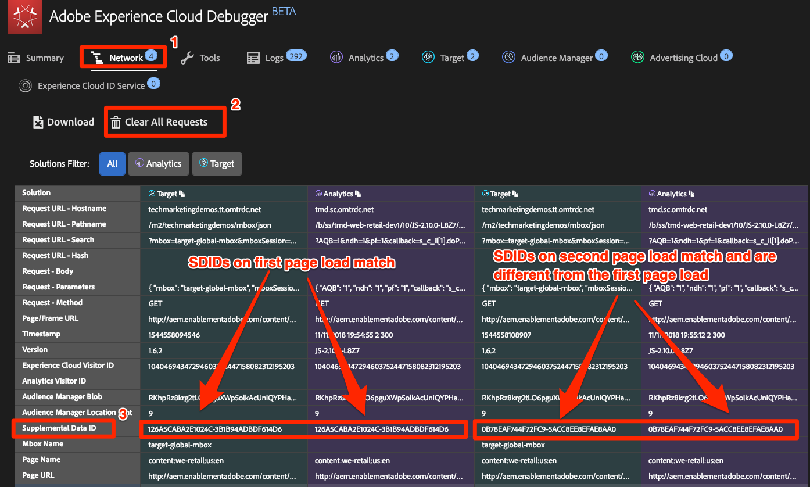

# Experience Cloud-Integrationen

In dieser Lektion werden Sie die wichtigsten Integrationen zwischen den soeben implementierten Lösungen überprüfen. Die gute Nachricht ist, dass Sie mit dem Abschluss der früheren Lektionen bereits die Code-Aspekte der Integrationen implementiert haben! In dieser Lektion müssen Sie also lediglich lesen und überprüfen.

## Lernziele

Am Ende dieser Lektion können Sie:

1. die grundlegenden Anwendungsfälle für die Integration von Zielgruppenfreigaben, Analytics for Target (A4T) und Kundenattributen erklären
1. die grundlegenden clientseitigen Implementierungsaspekte dieser Integrationen überprüfen

## Voraussetzungen

Bevor Sie die Anleitungen in dieser Lektion befolgen, sollten Sie alle vorherigen Lektionen in diesem Tutorial abschließen.

>[!NOTE]
>
>Es gibt viele Anforderungen an Benutzerberechtigungen, Kontokonfigurationen und Bereitstellungsschritte, die für die vollständige Verwendung dieser Integrationen erforderlich sind und die über den Rahmen dieses Tutorials hinausgehen. Wenn Sie diese Integrationen noch nicht in Ihrer aktuellen Experience Cloud-Implementierung verwenden, sollten Sie Folgendes berücksichtigen:
>
>* Überprüfen Sie die vollständigen Anforderungen der [Core Services-Integrationen.](https://experienceleague.adobe.com/docs/core-services/interface/about-core-services/core-services.html?lang=de)
>* Überprüfen Sie die vollständigen Anforderungen für die [Integration von Analytics for Target](https://experienceleague.adobe.com/docs/target/using/integrate/a4t/before-implement.html)
>* Bitten Sie einen Administrator Ihrer Experience Cloud-Organisation, die [Bereitstellung dieser Integrationen anzufordern](https://www.adobe.com/go/audiences)

## Zielgruppen

[Zielgruppen](https://experienceleague.adobe.com/docs/core-services/interface/audiences/audience-library.html) sind Teil des zentralen Dienstes „Personen“ und ermöglichen es Ihnen, Zielgruppen zwischen verschiedenen Lösungen zu teilen. Sie können beispielsweise eine Zielgruppe in Audience Manager erstellen und sie verwenden, um mit Target personalisierte Inhalte bereitzustellen.

Die wichtigsten Voraussetzungen für die Implementierung von A4T – die Sie bereits erfüllt haben – sind:

1. Implementieren von Adobe Experience Platform Identity Service
1. Implementieren von Audience Manager
1. Implementieren anderer Lösungen, in denen Sie Zielgruppen empfangen oder erstellen möchten, z. B. Target und Analytics

### Überprüfen der Zielgruppenintegration

Die beste Methode zur Überprüfung der Zielgruppenintegration besteht darin, eine Zielgruppe zu erstellen, sie mit einer anderen Lösung zu teilen und sie dann in vollem Umfang in der anderen Lösung zu verwenden (z. B. zu bestätigen, dass ein Besucher, der sich für ein AAM-Segment qualifiziert, sich für eine Target-Aktivität für dieses Segment qualifizieren kann). Das überschreitet jedoch den Rahmen dieses Tutorials.

Diese Überprüfungsschritte konzentrieren sich auf den wichtigsten Teil, der in der clientseitigen Implementierung sichtbar ist: die Besucher-ID.

1. Öffnen Sie die [Site „Luma“](https://luma.enablementadobe.com/content/luma/us/en.html).

1. Stellen Sie sicher, dass der Debugger die Tag-Eigenschaft *Ihrer* Entwicklungsumgebung zuordnet, wie in der [früheren Lektion](switch-environments.md) beschrieben.

   

1. Navigieren Sie zur Registerkarte „Netzwerk“ des Debuggers.

1. Klicken Sie auf **[!UICONTROL Alle Anforderungen löschen]** , nur um die Elemente zu bereinigen.

1. Laden Sie die Seite „Luma“ erneut und stellen Sie dabei sicher, dass die Anforderungen von Target und Analytics im Debugger angezeigt werden.

1. Laden Sie die Seite „Luma“ erneut.

1. Auf der Registerkarte „Netzwerk“ im Debugger sollten vier Anforderungen angezeigt werden: zwei für Target und zwei für Analytics.

1. Sehen Sie sich die Zeile „Experience Cloud-Besucher-ID“ an. Die IDs in jeder einzelnen Anforderung sollten immer gleich sein.

   

1. Die IDs sind pro Besucher eindeutig, was Sie bestätigen können, indem Sie einen Kollegen bitten, diese Schritte zu wiederholen.

## Analytics for Target (A4T)

Mit der Integration von [Analytics for Target (A4T)](https://experienceleague.adobe.com/docs/target/using/integrate/a4t/a4t.html) können Sie Ihre Analytics-Daten als Quelle für die Berichterstellungsmetriken in Target nutzen.

Die wichtigsten Voraussetzungen für die Implementierung von A4T – die Sie bereits erfüllt haben – sind:

1. Implementieren von Adobe Experience Platform Identity Service
1. Auslösen der Target-Ladeanforderung vor dem Analytics-Beacon zur Seitenansicht

A4T funktioniert, indem eine serverseitige Anforderung von Target an Analytics mit dem Analytics-Beacon zur Seitenansicht zusammengeführt wird. Dieser Vorgang wird „Trefferzuordnung“ genannt.  Für die Trefferzuordnung muss die Target-Anforderung, die die Aktivität bereitstellt (oder eine Target-basierte Zielmetrik erhöht), einen Parameter aufweisen, der einem Parameter im Analytics-Beacon zur Seitenansicht entspricht. Dieser Parameter wird als SDID (Supplemental Data ID, ID für zusätzliche Daten) bezeichnet.

### Überprüfen der A4T-Implementierung

Der beste Weg, die A4T-Integration zu validieren, besteht darin, eine Target-Aktivität mit A4T zu erstellen und die Berichtsdaten zu überprüfen. Das überschreitet jedoch den Rahmen dieses Tutorials. In diesem Tutorial erfahren Sie, wie Sie überprüfen können, ob die SDIDs der Lösungsaufrufe übereinstimmen.

**Überprüfen der SDIDs**

1. Öffnen Sie die [Site „Luma“](https://luma.enablementadobe.com/content/luma/us/en.html).

1. Stellen Sie sicher, dass der Debugger die Tag-Eigenschaft *Ihrer* Entwicklungsumgebung zuordnet, wie in der [früheren Lektion](switch-environments.md) beschrieben.

   

1. Navigieren Sie zur Registerkarte „Netzwerk“ des Debuggers.

1. Klicken Sie auf **[!UICONTROL Alle Anforderungen löschen]** , nur um die Elemente zu bereinigen.

1. Laden Sie die Seite „Luma“ erneut und stellen Sie dabei sicher, dass die Anforderungen von Target und Analytics im Debugger angezeigt werden.

1. Laden Sie die Seite „Luma“ erneut.

1. Auf der Registerkarte „Netzwerk“ im Debugger sollten vier Anforderungen angezeigt werden: zwei für Target und zwei für Analytics.

1. Überprüfen Sie die Spalte mit den IDs für zusätzliche Daten. Die IDs aus dem ersten Seitenladevorgang sollten zwischen Target und Analytics übereinstimmen. Die IDs des zweiten Seitenladevorgangs sollten ebenfalls übereinstimmen, unterscheiden sich jedoch von denen des ersten Seitenladevorgangs.

   

Wenn Sie innerhalb eines Seitenladevorgangs (ausgenommen Einzelseitenanwendungen) zusätzliche Target-Anforderungen vornehmen, die Teil von A4T-Aktivitäten sind, benennen Sie diese eindeutig (nicht mit „target-global-mbox“), damit sie weiterhin dieselben SDIDs der ursprünglichen Target- und Analytics-Anforderungen aufweisen.

## Kundenattribute

[Kundenattribute](https://experienceleague.adobe.com/docs/core-services/interface/customer-attributes/attributes.html?lang=de) sind Teil des zentralen Dienstes „Personen“, mit dem Sie Daten aus Ihrer CRM-Datenbank (Customer Relationship Management) hochladen und in Adobe Analytics sowie Adobe Target nutzen können.

Die wichtigsten Voraussetzungen für die Implementierung von Kundenattributen – die Sie bereits erfüllt haben – sind:

1. Implementieren von Adobe Experience Platform Identity Service
1. Festlegen von Kunden-IDs über den ID-Dienst *bevor* Target und Analytics ihre Anforderungen auslösen (dies erreichen Sie mithilfe der Regelsortierungsfunktion in -Tags)

### Überprüfen der Implementierung von Kundenattributen

Sie haben bereits in früheren Lektionen überprüft, dass die Kunden-IDs sowohl an den Identity Service als auch an Target übergeben werden. Sie können auch die Kunden-ID im Analytics-Treffer überprüfen.
Derzeit ist die Kunden-ID einer der wenigen Parameter, die nicht in Experience Cloud Debugger angezeigt werden. Verwenden Sie daher die JavaScript-Konsole des Browsers, um sie anzuzeigen.

1. Öffnen Sie die Site „Luma“.
1. Öffnen Sie die Entwicklertools Ihres Browsers.
1. Navigieren Sie zur Registerkarte „Netzwerk“.
1. Geben Sie in das Filterfeld `b/ss` ein, wodurch die Anzeige auf die Adobe Analytics-Anforderungen beschränkt wird.

   

1. Klicken Sie oben rechts auf der Site auf den Link **[!UICONTROL ANMELDEN]** .

   

1. Geben Sie `test@adobe.com` als Benutzernamen ein.
1. Geben Sie `test` als Passwort ein.
1. Klicken Sie auf die Schaltfläche **[!UICONTROL ANMELDEN]**

   

1. Dies sollte Sie auf die Startseite zurückführen, was auch ein Beacon auslöst, das Sie in den Entwicklertools sehen können. Wenn Sie auf die Seite mit den Kontoinformationen gelangen, klicken Sie auf das WE.RETAIL-Logo, um zur Startseite zurückzukehren.
1. Klicken Sie auf die Anforderung und wählen Sie die Registerkarte „Kopfzeilen“ aus.
1. Scrollen Sie nach unten, bis einige verschachtelte Parameter angezeigt werden.
   1. cid – das Standardtrennzeichen für den Kunden-ID-Teil der Anforderung
   1. crm_id – das ist der benutzerdefinierte Integrationscode, den Sie in der Lektion zum Identity Service angegeben haben
   1. id - der Kunden-ID-Wert, der von Ihrem `Email (Hashed)`-Datenelement stammt
   1. as – der Authentifizierungsstatus, wobei „1“ angemeldet bedeutet

   

[Weiter mit &quot;Publish your Property&quot;>](publish.md)
