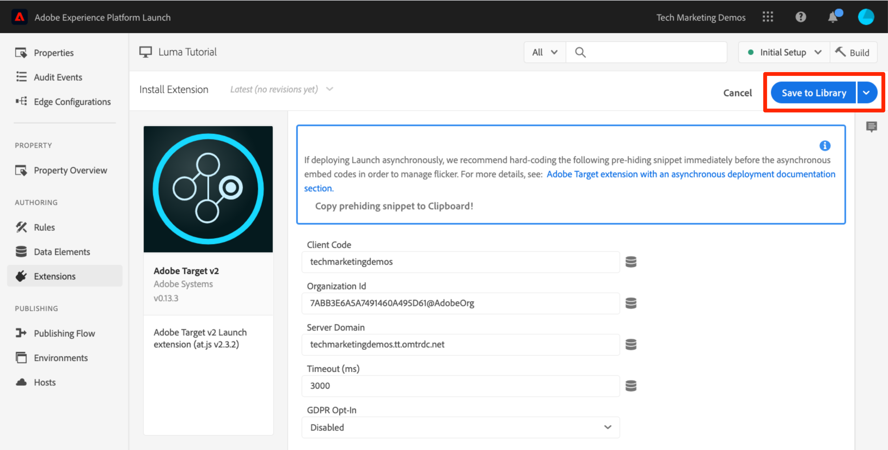
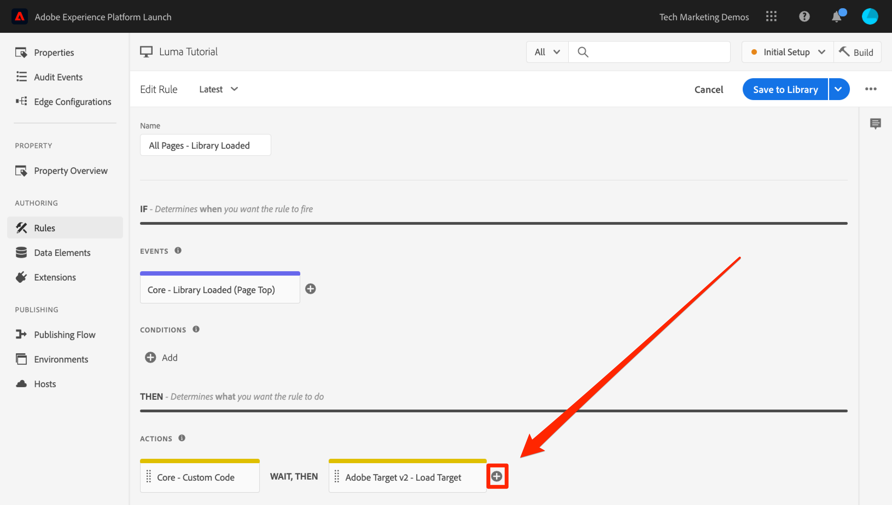

# Hinzufügen von Adobe Target

In dieser Lektion implementieren wir die [Adobe Target-Erweiterung](https://experienceleague.adobe.com/docs/experience-platform/tags/extensions/adobe/target/overview.html?lang=de) mit einer Seitenladeanforderung und benutzerdefinierten Parametern.

[Adobe Target](https://docs.adobe.com/content/help/de-DE/experience-cloud/user-guides/home.translate.html) ist die Adobe Experience Cloud-Lösung, die Ihnen all das bietet, was Sie benötigen, um die Erlebnisse Ihrer Kunden anzupassen und zu personalisieren, sodass Sie Umsätze auf Ihren Web- und mobilen Sites, in Apps, sozialen Medien und anderen digitalen Kanälen maximieren können.

>[!NOTE]
>
>Adobe Experience Platform Launch wird als eine Suite von Datenerfassungstechnologien in Adobe Experience Platform integriert. In der Benutzeroberfläche wurden verschiedene terminologische Änderungen eingeführt, die Sie bei der Verwendung dieses Inhalts beachten sollten:
>
> * platform launch (Client-seitig) ist jetzt **[!DNL tags]**
> * platform launch Server Side ist jetzt **[!DNL event forwarding]**
> * Edge-Konfigurationen sind jetzt verfügbar **[!DNL datastreams]**


## Lernziele

Am Ende dieser Lektion können Sie:

* Fügen Sie den Codeausschnitt zur Vorab-Ausblendung hinzu, der bei der Verwendung von Target mit asynchronen Tag-Einbettungscodes verwendet wird, um Flackern zu verhindern.
* Target v2-Erweiterung hinzufügen
* Seitenladeanforderung (früher „globale Mbox“) auslösen
* Parameter zur Seitenladeanforderung hinzufügen
* erklären, wie Profil- und Entitätsparameter zur Seitenladeanforderung hinzugefügt werden können
* Bestellbestätigungsanforderung mit den erforderlichen Parametern auslösen
* erklären, wie Sie erweiterte Konfigurationen wie Bibliothekskopf- und -fußzeile hinzufügen
* eine Target-Implementierung überprüfen

## Voraussetzungen

Um die Lektionen in diesem Abschnitt abzuschließen, müssen Sie zunächst die Lektionen in [Tags konfigurieren](create-a-property.md) und [Hinzufügen des ID-Dienstes](id-service.md).

## Hinzufügen des Codeausschnitts zur Vorab-Ausblendung in Target

Bevor wir beginnen, müssen wir die Tag-Einbettungscodes geringfügig aktualisieren. Wenn die Tag-Einbettungscodes asynchron geladen werden, kann das Rendern der Seite abgeschlossen sein, bevor die Target-Bibliothek vollständig geladen ist und den Inhaltsaustausch durchgeführt hat. Dies kann zum sogenannten „Flackern“ führen. Dabei wird kurz der Standardinhalt angezeigt, bevor er durch den von Target angegebenen personalisierten Inhalt ersetzt wird. Wenn Sie dieses Flimmern vermeiden möchten, empfehlen wir dringend, einen speziellen Codeausschnitt zur Vorab-Ausblendung unmittelbar vor den asynchronen Einbettungscodes der Tags fest zu codieren.

Dies wurde bereits auf der Site „Luma“ durchgeführt, aber lassen Sie uns fortfahren und dies auf der Beispielseite tun, damit Sie die Implementierung verstehen. Kopieren Sie die folgenden Codezeilen:

```html
<script>
   //prehiding snippet for Adobe Target with asynchronous tags deployment
   ;(function(win, doc, style, timeout) {
   var STYLE_ID = 'at-body-style';
   function getParent() {
      return doc.getElementsByTagName('head')[0];
   }
   function addStyle(parent, id, def) {
      if (!parent) {
      return;
      }
      var style = doc.createElement('style');
      style.id = id;
      style.innerHTML = def;
      parent.appendChild(style);
   }
   function removeStyle(parent, id) {
      if (!parent) {
      return;
      }
      var style = doc.getElementById(id);
      if (!style) {
      return;
      }
      parent.removeChild(style);
   }
   addStyle(getParent(), STYLE_ID, style);
   setTimeout(function() {
      removeStyle(getParent(), STYLE_ID);
   }, timeout);
   }(window, document, "body {opacity: 0 !important}", 3000));
</script>
```

Öffnen Sie die Beispielseite und fügen Sie sie direkt vor Ihrem Tag-Einbettungscode ein, wie unten dargestellt (keine Sorge, wenn die Zeilennummern unterschiedlich sind). In diesem Screenshot wurde der vorab ausgeblendete Ausschnitt minimiert:


Laden Sie Ihre Musterseite erneut. Sie werden feststellen, dass die Seite drei Sekunden lang ausgeblendet wird, bevor sie angezeigt wird. Dieses Verhalten ist temporär und verschwindet, nachdem Sie Target bereitgestellt haben. Das Verhalten der Vorab-Ausblendung wird durch zwei Konfigurationen am Ende des Codeausschnitts zur Vorab-Ausblendung gesteuert. Diese können angepasst werden, jedoch empfiehlt es sich in der Regel, die Standardeinstellungen beizubehalten:

* `body {opacity: 0 !important}` gibt die CSS-Definition an, die für die Vorab-Ausblendung bis zum Laden von Target verwendet werden soll. Standardmäßig wird der gesamte Seiteninhalt ausgeblendet. Wenn Sie eine einheitliche DOM-Struktur mit einem Containerelement nutzen, das einfach zu identifizieren ist und z. B. den gesamten Inhalt unter Ihrer Navigation umfasst, und die Navigation in keinem Fall testen oder personalisieren möchten, können Sie diese Einstellung nutzen, um die Vorab-Ausblendung auf dieses Containerelement zu beschränken.
* `3000` Gibt die Zeitüberschreitungseinstellung für die Voraub-Ausblendung an. Standardmäßig gilt: Wenn Target nach drei Sekunden nicht geladen wurde, wird die Seite angezeigt. Dieser Fall sollte nur extrem selten auftreten.

Weitere Informationen sowie den nicht minimierten Codeausschnitt zur Vorab-Ausblendung finden Sie unter [Adobe Target-Erweiterung mit einer asynchronen Bereitstellung](https://experienceleague.adobe.com/docs/experience-platform/tags/extensions/adobe/target/overview.html#adobe-target-extension-with-an-asynchronous-deployment).

## Hinzufügen der Target-Erweiterung

Die Adobe Target-Erweiterung unterstützt clientseitige Implementierungen mithilfe des JavaScript SDK von Target für das moderne Web: at.js. Kunden, die weiterhin die ältere Target-Bibliothek mbox.js verwenden, [sollte auf at.js 2.x aktualisieren](https://experienceleague.adobe.com/docs/target/using/implement-target/client-side/mbox-implement/migrate-mbox/target-atjs-implementation.html) um Tags zu verwenden.

Die Target v2-Erweiterung besteht aus zwei Hauptteilen:

1. der Konfiguration der Erweiterung, die die Einstellungen der Hauptbibliothek verwaltet
1. Regelaktionen für folgende Funktionen:
   1. Laden von Target (at.js 2.x)
   1. Hinzufügen von Parametern zu Seitenladeanforderungen
   1. Hinzufügen von Parametern zu allen Anforderungen
   1. Auslösen einer Seitenladeanforderung

In dieser ersten Übung werden wir die Erweiterung hinzufügen und die Konfigurationen betrachten. In späteren Übungen werden wir die Aktionen nutzen.

**Hinzufügen der Erweiterung**

1. Navigieren Sie zu **[!UICONTROL Erweiterungen > Katalog]**.
1. Geben Sie `target` in den Filter ein, um die Adobe Target-Erweiterungen schnell zu finden. Es gibt zwei Erweiterungen: Adobe Target und Adobe Target v2. In diesem Tutorial wird die Version v2 der Erweiterung verwendet, die die neueste Version von at.js (derzeit 2.x) verwendet, die sowohl für traditionelle Websites als auch für Einzelseitenanwendungen (SPA) ideal ist.
1. Klicken Sie auf **[!UICONTROL Installieren]**.

   

1. Wenn Sie die Erweiterung hinzufügen, werden viele, aber nicht alle at.js-Einstellungen aus der Target-Oberfläche importiert, wie unten dargestellt. Eine Einstellung, die nicht importiert wird, ist die Zeitüberschreitung, die nach dem Hinzufügen der Erweiterung stets 3000 ms beträgt. Behalten Sie für das Tutorial die Standardeinstellungen bei. Beachten Sie, dass auf der linken Seite die at.js-Version angezeigt wird, die mit der aktuellen Version der Erweiterung geliefert wird.

1. Klicken Sie auf **[!UICONTROL In Bibliothek speichern]**.

   

Zu diesem Zeitpunkt führt Target noch keine Aktionen aus, weshalb auch nichts zu überprüfen ist.

>[!NOTE]
>
>Jede Version der Target-Erweiterung enthält eine spezifische Version von at.js, die in der Erweiterungsbeschreibung aufgeführt ist. Sie aktualisieren die ar.js-Version, indem Sie die Target-Erweiterung aktualisieren.

## Laden von Target und Auslösen der Seitenladeanforderung

Marketingexperten können Target verwenden, um beim Testen und Targeting von Inhalten das Besuchererlebnis auf der Seite zu steuern. Aufgrund dieser wichtigen Rolle in der Anzeige der Seite sollte Target so früh wie möglich geladen werden, um Auswirkungen auf die Seitenanzeige zu minimieren. In diesem Abschnitt laden wir die JavaScript-Bibliothek von Target – at.js – und lösen die Seitenladeanforderung au (in früheren Versionen von at.js als „globale Mbox“ bezeichnet).

Sie können die `All Pages - Library Loaded`-Regel, die Sie in der Lektion [Hinzufügen von Datenelementen, Regeln und Bibliotheken](add-data-elements-rules.md) erstellt haben, zur Implementierung von Target verwenden, da sie beim Laden der Seite bereits so früh wie möglich ausgelöst wird.

**Laden von Target**

1. Navigieren Sie zu **[!UICONTROL Regeln]** in der linken Navigation und klicken Sie dann auf `All Pages - Library Loaded` zum Öffnen des Regeleditors

   

1. Klicken Sie unter „Aktionen“ auf , um eine neue Aktion hinzuzufügen.

   

1. Wählen Sie **[!UICONTROL Erweiterung > Adobe Target v2]** aus.

1. Wählen Sie **[!UICONTROL Aktionstyp > Target laden]** aus.

1. Klicken Sie auf **[!UICONTROL Änderungen beibehalten]**

   

Mit der hinzugefügten `Load Target`-Aktion wird at.js auf der Seite geladen. Es werden jedoch keine Target-Anforderungen ausgelöst, bis wir die `Fire Page Load Request`-Aktion hinzufügen.

**Auslösen einer Seitenladeanforderung**

1. Klicken Sie unter „Aktionen“ erneut auf , um eine weitere neue Aktion hinzuzufügen.

   

1. Wählen Sie **[!UICONTROL Erweiterung > Adobe Target v2]** aus.

1. Wählen Sie **[!UICONTROL Aktionstyp > Seitenladeanforderung auslösen]** aus.

1. Es gibt einige Konfigurationen für die Seitenladeanforderung, die sich darauf beziehen, ob die Seite ausgeblendet und welcher CSS-Selektor für die Vorab-Ausblendung verwendet werden soll. Diese Einstellungen funktionieren zusammen mit dem auf der Seite fest codierten Codeausschnitt für die Vorab-Ausblendung. Behalten Sie die Standardeinstellungen bei.

1. Klicken Sie auf **[!UICONTROL Änderungen beibehalten]**

   

1. Die neue Aktion wird in der Reihenfolge nach der `Load Target`-Aktion hinzugefügt und die Aktionen werden in dieser Reihenfolge ausgeführt. Sie können die Aktionen per Drag&amp;Drop verschieben, um die Reihenfolge neu anzuordnen. In diesem Szenario muss `Load Target` allerdings vor `Fire Page Load Request` stehen.

1. Klicken Sie auf **[!UICONTROL In Bibliothek speichern und erstellen]**.

   

### Überprüfen der Seitenladeanforderung

Jetzt haben Sie die Target v2-Erweiterung hinzugefügt und den `Load Target` und `Fire Page Load Request` -Aktionen verwenden, sollte auf allen Seiten, auf denen Ihre Tag-Eigenschaft verwendet wird, eine Seitenladeanforderung durchgeführt werden.

**Überprüfen der Aktionen „Target Laden“ und „Seitenladeanforderung auslösen“**

1. Laden Sie Ihre Musterseite erneut. Die Verzögerung von drei Sekunden sollte nicht mehr angezeigt werden, bevor die Seite sichtbar ist. Wenn Sie die Beispielseite mit dem `file://`-Protokoll laden, sollten Sie diesen Schritt in einem Firefox- oder Safari-Browser durchführen, da Chrome bei Verwendung des `file://`-Protokolls keine Target-Anforderung auslöst.

1. Öffnen Sie die [Site „Luma“](https://luma.enablementadobe.com/content/luma/us/en.html).

1. Stellen Sie sicher, dass der Debugger die Tag-Eigenschaft zu *Ihre* Entwicklungsumgebung, wie im Abschnitt [frühere Lektion](switch-environments.md)

   

1. Navigieren Sie zur Registerkarte „Zusammenfassung“ des Debuggers.

1. Stellen Sie im Abschnitt `Launch` sicher, dass `Target` unter der Überschrift `Extensions` aufgeführt ist

1. Überprüfen Sie im Abschnitt `Target`, ob Ihre Version der at.js-Bibliothek angezeigt wird.

   

1. Öffnen Sie abschließend die Registerkarte `Target`, erweitern Sie Ihren Client-Code und bestätigen Sie, dass Ihre Seitenladeanforderung angezeigt wird:

   

Herzlichen Glückwunsch! Sie haben Target implementiert!

## Hinzufügen von Parametern

Die Übergabe von Parametern in der Target-Anforderung ermöglicht leistungsstarke Funktionen für Targeting-, Test- und Personalisierungsaktivitäten. Die Tag-Erweiterung bietet zwei Aktionen zum Übergeben von Parametern:

1. `Add Params to Page Load Request` fügt Parameter zu Seitenladeanforderungen hinzu (entspricht der [targetPageParams()](https://experienceleague.adobe.com/docs/target/using/implement-target/client-side/functions-overview/cmp-atjs-functions.html)-Methode)

1. `Add Params to All Requests` fügt Parameter in allen Target-Anforderungen hinzufügt, z. B. in der Seitenladeanforderung und zusätzlichen Anforderungen, die von Aktionen mit benutzerdefiniertem Code ausgeführt oder auf Ihrer Site fest codiert wurden (entspricht der [targetPageParamsAll()](https://experienceleague.adobe.com/docs/target/using/implement-target/client-side/functions-overview/cmp-atjs-functions.html)-Methode)

Diese Aktionen können *vor* der `Load Target`-Aktion verwendet werden und basierend auf Ihren Regelkonfigurationen auf verschiedenen Seiten unterschiedliche Parameter festlegen. Verwenden Sie die Funktion zur Regelsortierung, die Sie beim Festlegen von Kunden-IDs mit dem ID-Dienst verwendet haben, um zusätzliche Parameter für das `Library Loaded`-Ereignis festzulegen, bevor die Regel die Seitenladeanforderung auslöst.
>[!TIP]
>
>Da die meisten Implementierungen die Seitenladeanforderung für die Aktivitätsbereitstellung verwenden, reicht es in der Regel aus, nur die `Add Params to Page Load Requests`-Aktion zu verwenden.

### Anforderungsparameter (mbox)

Parameter werden verwendet, um benutzerdefinierte Daten an Target weiterzugeben und damit Ihre Personalisierungsfunktionen zu erweitern. Sie eignen sich ideal für Attribute, die sich während einer Browser-Sitzung häufig ändern, wie z. B. der Seitenname, die Vorlage usw. und nicht persistent sind.

Fügen wir das `Page Name`-Datenelement, das wir zuvor in der Lektion [Hinzufügen von Datenelementen, Regeln und Bibliotheken](add-data-elements-rules.md) hinzugefügt haben, als Anforderungsparameter hinzu.

**Hinzufügen von Anforderungsparametern**

1. Navigieren Sie zu **[!UICONTROL Regeln]** in der linken Navigation und klicken Sie dann auf `All Pages - Library Loaded` , um den Regeleditor zu öffnen.

   

1. Klicken Sie unter „Aktionen“ auf , um eine neue Aktion hinzuzufügen.

   

1. Wählen Sie **[!UICONTROL Erweiterung > Adobe Target v2]** aus.

1. Wählen Sie **[!UICONTROL Aktionstyp > Parameter zur Seitenladeanforderung hinzufügen]** aus.

1. Geben Sie `pageName` als den **[!UICONTROL Namen]** ein.

1. Klicken Sie auf , um das Datenelement-Modal zu öffnen.

1. Klicken Sie auf das `Page Name`- Datenelement.

1. Klicken Sie auf die Schaltfläche **[!UICONTROL Auswählen]**.

   

1. Klicken Sie auf **[!UICONTROL Änderungen beibehalten]**

   

1. Klicken Sie auf den linken Rand der `Add Params to Page Load Request`-Aktion und ziehen Sie sie, um die Aktionen vor der `Fire Page Load Request`-Aktion neu anzuordnen (sie können vor oder nach `Load Target` sein).

1. Klicken Sie auf **[!UICONTROL In Bibliothek speichern und erstellen]**.

   

#### Überprüfen der Anforderungsparameter

Derzeit sind benutzerdefinierte Parameter, die mit at.js 2.x-Anforderungen übergeben werden, im Debugger nicht leicht sichtbar. Daher werden die Entwicklertools des Browsers verwendet.

**Überprüfen des Anforderungsparameters „pageName“**

1. Laden Sie die Site &quot;Luma&quot;neu und stellen Sie sicher, dass sie Ihrer eigenen Tag-Eigenschaft zugeordnet ist.
1. Öffnen Sie die Entwicklertools Ihres Browsers.
1. Klicken Sie auf die Registerkarte „Netzwerk“.
1. Filtern Sie die Anforderungen nach `tt.omtrdc` (oder Ihrer CNAMEd-Domäne für Target-Anforderungen).
1. Erweitern Sie den Abschnitt `Headers` > `Request Payload` > `execute.pageLoad.parameters`, um den `pageName`-Parameter und -Wert zu überprüfen.


<!--Now go to the **[!UICONTROL Target]** tab in the Debugger. Expand your client code and look at the requests. You should see the new `pageName` parameter passed in the request:

-->

### Profilparameter

Ähnlich wie Anforderungsparameter werden Profilparameter auch über die Target-Anforderungen übergeben. Profilparameter werden jedoch in der Besucherprofildatenbank von Target gespeichert und bleiben für die [Dauer des Besucherprofils](https://experienceleague.adobe.com/docs/target/using/audiences/visitor-profiles/visitor-profile-lifetime.html) bestehen. Sie können sie auf einer Seite Ihrer Site festlegen und in Target-Aktivitäten auf einer anderen Seite verwenden. Im Folgenden finden Sie ein Beispiel einer Automobilwebsite. Wenn ein Besucher zu einer Fahrzeugseite wechselt, können Sie den Profilparameter „profile.lastViewed=sportscar“ übergeben, um sein Interesse an diesem bestimmten Fahrzeug aufzuzeichnen. Wenn der Besucher zu anderen Seiten als einer Fahrzeugseite navigiert, können Sie die Inhalte auf der Grundlage des zuletzt angezeigten Fahrzeugs anpassen.  Profilparameter eignen sich ideal für Attribute, die sich selten ändern oder nur auf bestimmten Seiten verfügbar sind

Sie werden in diesem Tutorial keine Profilparameter übergeben, doch der Arbeitsablauf ist fast identisch mit den Schritten zur Übergabe des `pageName`-Parameters. Der einzige Unterschied besteht darin, dass Sie Profilparametern ein `profile.`-Präfix voranstellen müssen. So würde ein Profilparameter namens „userType“ in der `Add Params to Page Load Request`-Aktion aussehen:


### Entitätsparameter

Entitätsparameter sind spezielle Parameter, die aus drei Hauptgründen in [Recommendations-Implementierungen](https://experienceleague.adobe.com/docs/target/using/recommendations/plan-implement.html) verwendet werden:

1. Als Schlüssel zum Auslösen von Produktempfehlungen: Wenn Sie beispielsweise einen Empfehlungsalgorithmus verwenden, z. B. „Personen, die Produkt X angesehen haben, haben auch Produkt Y angesehen“, ist „X“ der „Schlüssel“ der Empfehlung. Es handelt sich normalerweise um die Produkt-SKU (`entity.id`) oder -kategorie (`entity.categoryId`), die der Besucher gerade anzeigt.
1. Zur Erfassung des Besucherverhaltens für Empfehlungsalgorithmen, wie z. B. „Zuletzt angezeigte Produkte“ oder „Am häufigsten angezeigte Produkte“
1. Zur Füllung des Recommendations-Katalogs. Recommendations enthält eine Datenbank aller Produkte oder Artikel auf Ihrer Website, damit sie im Empfehlungsangebot bereitgestellt werden können. Wenn Sie beispielsweise Produkte empfehlen, möchten Sie normalerweise Attribute wie den Produktnamen (`entity.name`) und ein Produktbild (`entity.thumbnailUrl`) anzeigen. Einige Kunden füllen ihren Katalog mithilfe von Backend-Feeds. Sie können jedoch auch mittels Entitätsparametern in Target-Anforderungen gefüllt werden.

Sie müssen in diesem Tutorial keine Entitätsparameter übergeben, aber der Workflow ist mit dem identisch, was Sie zuvor bei der Übergabe des `pageName` Anforderungsparameter: Geben Sie dem Parameter einfach einen Namen mit dem Präfix &quot;entity.&quot; und ordnen Sie ihn dem relevanten Datenelement zu. Beachten Sie, dass einige häufig verwendete Entitäten über reservierte Namen verfügen, die verwendet werden müssen (z. B. entity.id für die Produkt-SKU). So würde es aussehen, wenn Entitätsparameter in der `Add Params to Page Load Request`-Aktion festgelegt werden:


### Hinzufügen von Kunden-ID-Parametern

Die Erfassung von Kunden-IDs mit Adobe Experience Platform Identity Service erleichtert den Import von CRM-Daten in Target mithilfe der Funktion [Kundenattribute](https://experienceleague.adobe.com/docs/target/using/audiences/visitor-profiles/working-with-customer-attributes.html) in Adobe Experience Cloud. Sie ermöglicht auch die [geräteübergreifende Besucherzuordnung](https://experienceleague.adobe.com/docs/target/using/integrate/experience-cloud-device-co-op.html), sodass Sie eine einheitliche Benutzererfahrung gewährleisten können, wenn Ihre Kunden zwischen ihren Laptops und ihren Mobilgeräten wechseln.

Es ist unbedingt erforderlich, die Kunden-ID in der `Set Customer IDs`-Aktion des ID-Dienstes festzulegen, bevor die Seitenladeanforderung ausgelöst wird. Zu diesem Zweck müssen Sie die folgenden Funktionen auf Ihrer Site bereitstellen:

* Die Kunden-ID muss auf der Seite vor den Tags Einbettungscode verfügbar sein.
* Die Adobe Experience Platform Identity Service-Erweiterung muss installiert werden.
* Sie müssen die `Set Customer IDs`-Aktion in einer Regel verwenden, die beim Ereignis „Bibliothek geladen (Seitenanfang)“ ausgelöst wird.
* Verwenden Sie die `Fire Page Load Request`-Aktion in einer Regel, die *nach* der Aktion „Kunden-IDs festlegen“ ausgelöst wird.

In der vorherigen Lektion [Hinzufügen von Adobe Experience Platform Identity Service](id-service.md)`All Pages - Library Loaded - Authenticated - 10` haben Sie die Regel erstellt, um die Aktion „Kunden-ID festlegen“ auszulösen. Da diese Regel eine `Order`-Einstellung von `10` hat, werden die Kunden-IDs festgelegt, bevor unsere Seitenladeanforderung von der `All Pages - Library Loaded`-Regel ausgelöst wird, bei der die `Order`-Einstellung`50` ist. Sie haben also bereits die Erfassung von Kunden-IDs für Target implementiert!

#### Überprüfen der Kunden-ID

Derzeit sind benutzerdefinierte Parameter, die mit at.js 2.x-Anforderungen übergeben werden, im Debugger nicht leicht sichtbar. Daher werden die Entwicklertools des Browsers verwendet.

**Überprüfen der Kunden-ID**

1. Öffnen Sie die [Site „Luma“](https://luma.enablementadobe.com/content/luma/us/en.html).

1. Stellen Sie sicher, dass der Debugger die Tag-Eigenschaft zu *Ihre* Entwicklungsumgebung, wie im Abschnitt [frühere Lektion](switch-environments.md)

   

1. Melden Sie auf der Site „Luma“ sich mit den folgenden Anmeldeinformationen an: `test@adobe.com`/`test`
1. Kehren Sie zur [Startseite „Luma“](https://luma.enablementadobe.com/content/luma/us/en.html) zurück.

1. Öffnen Sie die Entwicklertools Ihres Browsers.
1. Klicken Sie auf die Registerkarte „Netzwerk“.
1. Filtern Sie die Anforderungen nach `tt.omtrdc` (oder Ihrer CNAMEd-Domäne für Target-Anforderungen).
1. Erweitern Sie den Abschnitt `Headers` > `Request Payload` > `id.customerIds.0`, um die Kunden-ID-Einstellungen und -Werte zu überprüfen:


<!--
1. Open the Debugger
1. Go to the Target tab
1. Expand your client code
1. You should see parameters in the latest Target request for `vst.crm_id.id` and `vst.crm_id.authState`. `vst.crm_id.id` should have a value of the hashed email address and `vst.crm_id.authState` should have a value of `1` to represent `authenticated`. Note that `crm_id` is the `Integration Code` you specified in the Identity Service configuration and must align with the key you use in your [Customer Attributes data file](https://experienceleague.adobe.com/docs/core-services/interface/customer-attributes/t-crs-usecase.html):


-->

>[!WARNING]
>
>Mit Adobe Experience Platform Identity Service können Sie mehrere IDs an den Service senden. Es wird jedoch nur die erste ID an Target gesendet.

### Hinzufügen des Parameters „Eigenschafts-Token“

>[!NOTE]
>
>Dies ist eine optionale Übung für Target Premium-Kunden.

Das Eigenschafts-Token ist ein reservierter Parameter, der mit der Target Premium-Funktion für [Enterprise-Benutzerberechtigungen](https://experienceleague.adobe.com/docs/target/using/administer/manage-users/enterprise/property-channel.html?lang=de) verwendet wird. Er wird zur Definition verschiedener digitaler Eigenschaften verwendet, damit unterschiedlichen Mitgliedern einer Experience Cloud-Organisation verschiedene Berechtigungen für die einzelnen Eigenschaften zugewiesen werden können. Sie möchten z. B., dass eine Gruppe von Benutzern Target-Aktivitäten auf Ihrer Website, aber nicht in Ihrer mobilen Anwendung einrichten kann.

Target-Eigenschaften entsprechen Tag-Eigenschaften und Analytics-Report Suites. Ein Unternehmen mit mehreren Marken, Websites und Marketingteams kann für jede Website oder mobile App eine andere Target-Eigenschaft, Tag-Eigenschaft und Analytics-Report Suite verwenden. Die Eigenschaften von Tags werden durch ihre Einbettungscodes unterschieden, Analytics-Report Suites durch ihre Report Suite-ID und Target-Eigenschaften durch ihren Eigenschafts-Token-Parameter.


Das Eigenschafts-Token muss mithilfe einer benutzerdefinierten Code-Aktion in -Tags mit der `targetPageParams()` -Funktion. Wenn Sie mehrere Sites mit unterschiedlichen at_property -Werten mit einer einzelnen Tag-Eigenschaft implementieren, können Sie den at_property -Wert über ein Datenelement verwalten.

Im Folgenden finden Sie eine optionale Übung für Target Premium-Kunden, wenn Sie ein Eigenschafts-Token in Ihrer Tutorial-Eigenschaft implementieren möchten:

1. Öffnen Sie auf einer separaten Registerkarte die Target-Benutzeroberfläche.

1. Navigieren Sie zu **[!UICONTROL Administration > Eigenschaften]**

1. Identifizieren Sie die Eigenschaft, die Sie verwenden möchten, und klicken Sie auf **[!UICONTROL &lt;/>]** (oder erstellen Sie eine neue Eigenschaft)

1. Kopieren Sie das Codefragment im `<script></script>` in die Zwischenablage

   

1. Navigieren Sie auf der Registerkarte Tags zur **[!UICONTROL Regeln]** in der linken Navigation und klicken Sie dann auf `All Pages - Library Loaded` , um den Regeleditor zu öffnen.

   

1. Klicken Sie unter „Aktionen“ auf die `Core - Custom Code`-Aktion, um `Action Configuration` zu öffnen.

   

1. Öffnen Sie den Code-Editor und fügen Sie den Code aus der Target-Oberfläche ein, die die `targetPageParams()` function
1. Klicken Sie auf die **[!UICONTROL Speichern]** button

   

1. Überprüfen Sie die **[!UICONTROL Globale Ausführung]** box so `targetPageParams()` im globalen Geltungsbereich deklariert
1. Klicken Sie auf **[!UICONTROL Änderungen beibehalten]**

   

1. Klicken Sie auf **[!UICONTROL In Bibliothek speichern und erstellen]**.

   

>[!WARNING]
>
>Wenn Sie versuchen, die `at_property` Parameter über die **[!UICONTROL Parameter zur Seitenladeanforderung hinzufügen]** -Aktion verwenden, wird der -Parameter in der Netzwerkanforderung aufgefüllt, der Visual Experience Composer (VEC) von Target kann ihn jedoch beim Laden der Seite nicht automatisch erkennen. Immer ausfüllen `at_property` mithilfe der `targetPageParams()` -Funktion in einer Aktion mit benutzerspezifischem Code verwenden.

#### Überprüfen des Eigenschafts-Tokens

Derzeit sind benutzerdefinierte Parameter, die mit at.js 2.x-Anforderungen übergeben werden, im Debugger nicht leicht sichtbar. Daher werden die Entwicklertools des Browsers verwendet.

**Überprüfen des Eigenschafts-Token-Parameters**

1. Öffnen Sie die [Site „Luma“](https://luma.enablementadobe.com/content/luma/us/en.html).
1. Stellen Sie sicher, dass der Debugger die Tag-Eigenschaft zu *Ihre* Entwicklungsumgebung, wie im Abschnitt [frühere Lektion](switch-environments.md)

   

1. Öffnen Sie die Entwicklertools Ihres Browsers.
1. Klicken Sie auf die Registerkarte „Netzwerk“.
1. Filtern Sie die Anforderungen nach `tt.omtrdc` (oder Ihrer CNAMEd-Domäne für Target-Anforderungen).
1. Erweitern Sie den Abschnitt `Headers` > `Request Payload` > `property.token`, um den Wert zu überprüfen.
   

<!--
1. Go to the `Target` tab
1. Expand your client code
1. You should see the parameter for "at_property" in every page load request request as you browse the site:

-->

## Hinzufügen benutzerdefinierter Anforderungen

### Hinzufügen einer Bestellbestätigungsanforderung

Die Bestellbestätigungsanforderung ist ein spezieller Anforderungstyp, mit dem Bestelldetails an Target gesendet werden. Die Einbeziehung von drei spezifischen Anforderungsparametern – orderId, orderTotal und productPurchasedId – macht eine reguläre Target-Anforderung zu einer Bestellanforderung. Neben Berichten zum Umsatz übernimmt die Bestellanforderung auch folgende Aufgaben:

1. Dedupliziert versehentlich mehrfach aufgegebene Bestellungen.
1. Filtert extreme Bestellungen (Bestellungen, deren Summe mehr als drei Standardabweichungen vom arithmetischen Mittel beträgt).
1. Verwendet im Hintergrund einen anderen Algorithmus zur Berechnung der statistischen Genauigkeit.
1. Erstellt einen speziellen, herunterladbaren Auditbericht für einzelne Bestelldetails.

Die Best Practice ist, eine Bestellbestätigungsanforderung in allen Bestelltrichtern zu verwenden, auch auf Nicht-Einzelhandels-Sites. Sites zur Lead-Generierung verfügen beispielsweise in der Regel über Lead-Trichter, bei denen am Ende eine eindeutige „Lead-ID“ generiert wird. Auf diesen Sites sollte eine Bestellanforderung mit einem statischen Wert (z. B. „1“) für orderTotal implementiert werden.

Kunden, die die Integration von Analytics for Target (A4T) für den Großteil ihrer Berichterstellung verwenden, können auch die Bestellanforderung bei Verwendung von Automated Personalization-Aktivitäten implementieren, die A4T nicht unterstützen. Darüber hinaus ist die Bestellanforderung ein wichtiges Element bei der Implementierung von Recommendations, die Algorithmen auf Basis des Kaufverhaltens aktivieren. Aktuelle Informationen zur A4T-Unterstützung finden Sie unter [die Dokumentation](https://experienceleague.adobe.com/docs/target/using/integrate/a4t/a4t.html?lang=en#section_F487896214BF4803AF78C552EF1669AA).

Die Bestellbestätigungsanforderung sollte über eine Regel ausgelöst werden, die nur auf Ihrer Bestellbestätigungsseite oder im entsprechenden Bestellbestätigungsereignis ausgelöst wird. Häufig kann sie mit einer Regel kombiniert werden, die das Kaufereignis von Adobe Analytics festlegt. Sie muss mithilfe einer Aktion vom Typ „Benutzerdefinierter Code:“ der Core-Erweiterung konfiguriert werden, indem Sie über die entsprechenden Datenelemente orderId, orderTotal und productPurchasedId festlegen.

Fügen wir die Datenelemente und die Regel hinzu, die wir benötigen, um eine Auftragsbestätigungsanforderung auf der Luma-Site auszulösen. Da Sie bereits mehrere Datenelemente erstellt haben, haben wir diese Anleitungen abgekürzt.

**Erstellen des Datenelements für die Bestell-ID**

1. Klicken **[!UICONTROL Datenelemente]** in der linken Navigation
1. Klicken Sie auf **[!UICONTROL Datenelement hinzufügen]**.
1. Benennen Sie das Datenelement `Order Id`.
1. Wählen Sie **[!UICONTROL Datenelementtyp > JavaScript-Variable]** aus.
1. Verwenden Sie `digitalData.cart.orderId` als `JavaScript variable name`.
1. Aktivieren Sie die Option `Clean text`.
1. Klicken Sie auf **[!UICONTROL In Bibliothek speichern]**.
(Wir werden die Bibliothek erst dann erstellen, wenn wir alle Änderungen für die Auftragsbestätigungsanforderung vorgenommen haben.)

**Erstellen des Datenelements für den Warenkorbbetrag**

1. Klicken Sie auf **[!UICONTROL Datenelement hinzufügen]**.
1. Benennen Sie das Datenelement `Cart Amount`.
1. Wählen Sie **[!UICONTROL Datenelementtyp > JavaScript-Variable]** aus.
1. Verwenden Sie `digitalData.cart.cartAmount` als `JavaScript variable name`.
1. Aktivieren Sie die Option `Clean text`.
1. Klicken Sie auf **[!UICONTROL In Bibliothek speichern]**.

**Erstellen des Datenelements für Warenkorb-SKUs (Target)**

1. Klicken Sie auf **[!UICONTROL Datenelement hinzufügen]**.
1. Benennen Sie das Datenelement `Cart SKUs (Target)`.
1. Wählen Sie **[!UICONTROL Datenelementtyp > Benutzerdefinierter Code]** aus.
1. Für Target müssen die SKUs in Form einer kommagetrennten Liste vorliegen. Dieser benutzerdefinierte Code formatiert das Daten-Layer-Array im richtigen Format. Fügen Sie im Editor für benutzerdefinierten Code Folgendes ein:

   ```javascript
   var targetProdSkus="";
   for (var i=0; i<digitalData.cart.cartEntries.length; i++) {
     if(i>0) {
       targetProdSkus = targetProdSkus + ",";
     }
     targetProdSkus = targetProdSkus + digitalData.cart.cartEntries[i].sku;
   }
   return targetProdSkus;
   ```

1. Aktivieren Sie die Option `Force lowercase value`.
1. Aktivieren Sie die Option `Clean text`.
1. Klicken Sie auf **[!UICONTROL In Bibliothek speichern]**.

Nun müssen wir eine Regel erstellen, um die Auftragsbestätigungsanforderung mit diesen Datenelementen als Parameter auf der Bestellbestätigungsseite auszulösen.

**Erstellen der Regel für die Auftragsbestätigungsseite**

1. Klicken **[!UICONTROL Regeln]** in der linken Navigation
1. Klicken Sie auf **[!UICONTROL Regel hinzufügen]**
1. Geben Sie einen Namen für die Regel ein `Order Confirmation Page - Library Loaded - 60`.
1. Klicken Sie auf **[!UICONTROL Ereignisse > Hinzufügen]**.
   1. Wählen Sie **[!UICONTROL Ereignistyp > Bibliothek geladen (Seitenanfang)]** aus.
   1. under **[!UICONTROL Erweiterte Optionen]**, ändern Sie die `Order` nach `60` damit sie nach der `Load Target` -Aktion (die in unserer `All Pages - Library Loaded` Regel, wenn `Order` auf `50`)
   1. Klicken Sie auf **[!UICONTROL Änderungen beibehalten]**
1. Klicken Sie auf **[!UICONTROL Bedingungen > Hinzufügen]**.
   1. Wählen Sie **[!UICONTROL Bedingungstyp > Pfad ohne Abfragezeichenfolge]** aus.
   1. Geben Sie für `Path equals` `thank-you.html` ein.
   1. Schalten Sie die Regex-Option ein, um die Logik von `equals` in `contains` zu ändern. Sie können die `Test`-Funktion verwenden, um zu bestätigen, dass der Test mit dieser URL absolviert wird: `https://luma.enablementadobe.com/content/luma/us/en/user/checkout/order/thank-you.html`

      

   1. Klicken Sie auf **[!UICONTROL Änderungen beibehalten]**
1. Klicken Sie auf **[!UICONTROL Aktionen > Hinzufügen]**.
   1. Wählen Sie **[!UICONTROL Aktionstyp > Benutzerdefinierter Code]**.
   1. Klicken Sie auf **[!UICONTROL Editor öffnen]**.
   1. Fügen Sie den folgenden Code in das `Edit Code`-Modal ein.

      ```javascript
      adobe.target.getOffer({
        "mbox": "orderConfirmPage",
        "params":{
           "orderId": _satellite.getVar('Order Id'),
           "orderTotal": _satellite.getVar('Cart Amount'),
          "productPurchasedId": _satellite.getVar('Cart SKUs (Target)')
        },
        "success": function(offer) {
          adobe.target.applyOffer({
            "mbox": "orderConfirmPage",
            "offer": offer
          });
        },
        "error": function(status, error) {
          console.log('Error', status, error);
        }
      });
      ```

   1. Klicken Sie auf **[!UICONTROL Speichern]**, um den benutzerdefinierten Code zu speichern.
   1. Klicken Sie auf **[!UICONTROL Änderungen beibehalten]**, um die Aktion beizubehalten.
1. Klicken Sie auf **[!UICONTROL In Bibliothek speichern und erstellen]**.

#### Überprüfen der Bestellbestätigungsanforderung

Derzeit sind benutzerdefinierte Parameter, die mit at.js 2.x-Anforderungen übergeben werden, im Debugger nicht leicht sichtbar. Daher werden die Entwicklertools des Browsers verwendet.

1. Öffnen Sie die [Site „Luma“](https://luma.enablementadobe.com/content/luma/us/en.html).

1. Stellen Sie sicher, dass der Debugger die Tag-Eigenschaft zu *Ihre* Entwicklungsumgebung, wie im Abschnitt [frühere Lektion](switch-environments.md)

   

1. Fügen Sie auf der Site mehrere Produkte zu Ihrem Einkaufswagen hinzu
1. Begeben Sie sich zum Checkout
1. Während des Checkout-Prozesses sind die einzig erforderlichen Felder `First Name` und `Last Name`

   

1. Klicken Sie auf der Seite „Bestellung überprüfen“ auf die Schaltfläche `Place Order`.
1. Öffnen Sie die Entwicklertools Ihres Browsers.
1. Klicken Sie auf die Registerkarte „Netzwerk“.
1. Filtern Sie die Anforderungen nach `tt.omtrdc` (oder Ihrer CNAMEd-Domäne für Target-Anforderungen).
1. Klicken Sie auf die zweite Anforderung.
1. Erweitern Sie den Abschnitt `Headers` > `Request Payload` > `execute.mboxes.0`, um den Anforderungsnamen und die Bestellparameter zu überprüfen:


<!--
1. Look in the Debugger
1. Go to the Target tab
1. Expand your client code
1. You should see the `orderConfirmPage` request as the latest Target request with the orderId, orderTotal, and productPurchasedId parameters populated with the details of your order

   link to "orderConfirmPage request with required parameters": images/target-debugger-orderConfirmPage.png 
-->

### Benutzerdefinierte Anforderungen

Es gibt nur wenige Fälle, in denen Sie andere Target-Anforderungen als die Seitenladeanforderung und die Bestellbestätigungsanforderung stellen müssen. Manchmal werden wichtige Daten, die Sie für die Personalisierung verwenden möchten, nicht vor den Tag-Einbettungscodes auf der Seite definiert. Sie können am Ende der Seite fest codiert sein oder von einer asynchronen API-Anfrage zurückgegeben werden. Diese Daten können mit einer zusätzlichen Anfrage an Target gesendet werden. Es ist jedoch nicht optimal, diese Anfrage für die Inhaltsbereitstellung zu verwenden, da die Seite bereits sichtbar ist. Diese Daten können verwendet werden, um das Besucherprofil zur späteren Verwendung anzureichern (mithilfe von Profilparametern) oder um den Recommendations-Katalog zu füllen.

Unter diesen Umständen verwenden Sie die Aktion mit benutzerdefiniertem Code in der Core-Erweiterung, um eine Anforderung mit den Methoden [getOffer()](https://experienceleague.adobe.com/docs/target/using/implement-target/client-side/functions-overview/adobe-target-getoffer.html)/[applyOffer()](https://experienceleague.adobe.com/docs/target/using/implement-target/client-side/functions-overview/adobe-target-applyoffer.html) und [trackEvent()](https://experienceleague.adobe.com/docs/target/using/implement-target/client-side/functions-overview/adobe-target-trackevent.html)
auszulösen. Dieser Vorgang ähnelt den Schritten sehr, die Sie in der [Bestellbestätigungsanforderung](#order-confirmation-request) durchgeführt haben. Sie verwenden einfach einen anderen Anforderungsnamen und nicht die speziellen Bestellparameter. Denken Sie daran, die **[!UICONTROL Target laden]**-Aktion zu verwenden, bevor Sie Target-Anforderungen aus benutzerdefiniertem Code durchführen.

## Bibliothekskopf- und -fußzeile

Der Bildschirm „at.js bearbeiten“ in der Target-Benutzeroberfläche enthält Felder, in denen Sie benutzerspezifischen JavaScript-Code einfügen können, damit er unmittelbar vor oder nach der Datei „at.js“ ausgeführt wird. Die Bibliothekskopfzeile wird manchmal verwendet, um at.js-Einstellungen über die
[targetGlobalSettings()](https://experienceleague.adobe.com/docs/target/using/implement-target/client-side/functions-overview/targetgobalsettings.html)-Funktion zu überschreiben oder Daten von Drittanbietern mithilfe der [Datenanbieter-Funktion](https://experienceleague.adobe.com/docs/target-learn/tutorials/integrations/use-data-providers-to-integrate-third-party-data.html) weiterzugeben. Die Bibliotheksfußzeile wird manchmal verwendet, um [at.js benutzerdefinierte Ereignis](https://experienceleague.adobe.com/docs/target/using/implement-target/client-side/functions-overview/atjs-custom-events.html) -Listener hinzuzufügen.

Um diese Funktion in Tags zu replizieren, verwenden Sie einfach die Aktion &quot;Benutzerspezifischer Code&quot;in der Haupterweiterung und positionieren Sie sie vor (Bibliothekskopfzeile) oder nach (Bibliotheksfußzeile) der Aktion &quot;Target laden&quot;. Hierfür können Sie dieselbe Regel nutzen wie für die `Load Target`-Aktion (siehe unten) oder separate Regeln mit Ereignissen oder Reihenfolgen verwenden, die zuverlässig vor oder nach der Regel mit `Load Target` ausgelöst werden:


Weitere Informationen zu Anwendungsfällen für benutzerdefinierte Kopf- und Fußzeilen finden Sie in den folgenden Ressourcen:

* [Verwenden von dataProviders zur Integration von Drittanbieterdaten in Adobe Target](https://experienceleague.adobe.com/docs/target-learn/tutorials/integrations/use-data-providers-to-integrate-third-party-data.html)
* [Implementierung von dataProviders zur Integration von Drittanbieterdaten in Adobe Target](https://experienceleague.adobe.com/docs/target-learn/tutorials/integrations/implement-data-providers-to-integrate-third-party-data.html)
* [Verwenden von Antwort-Token und benutzerspezifischen at.js-Ereignissen mit Adobe Target](https://experienceleague.adobe.com/docs/target-learn/tutorials/integrations/use-response-tokens-and-atjs-custom-events.html)

[Weiter mit „Hinzufügen von Adobe Analytics“ >](analytics.md)
